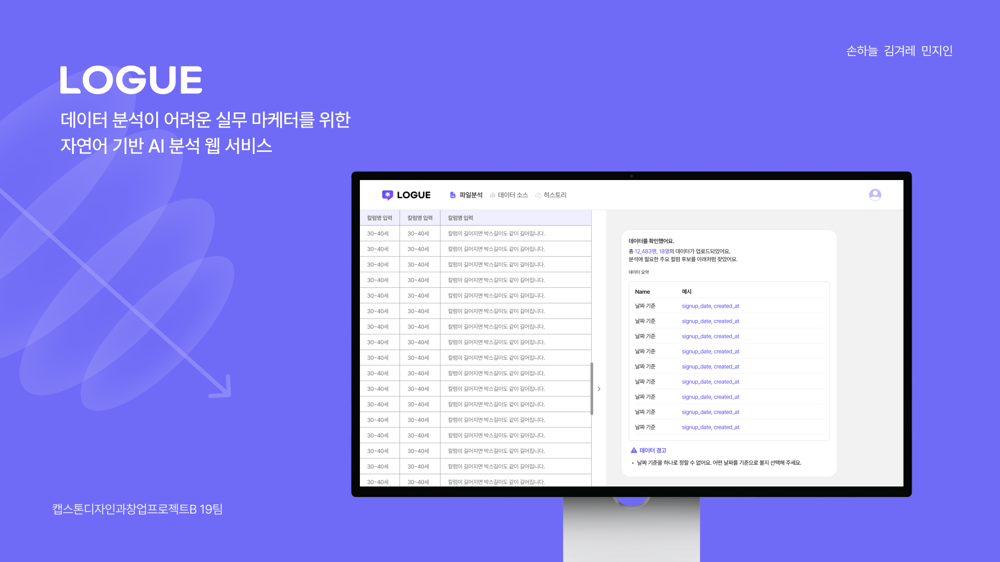
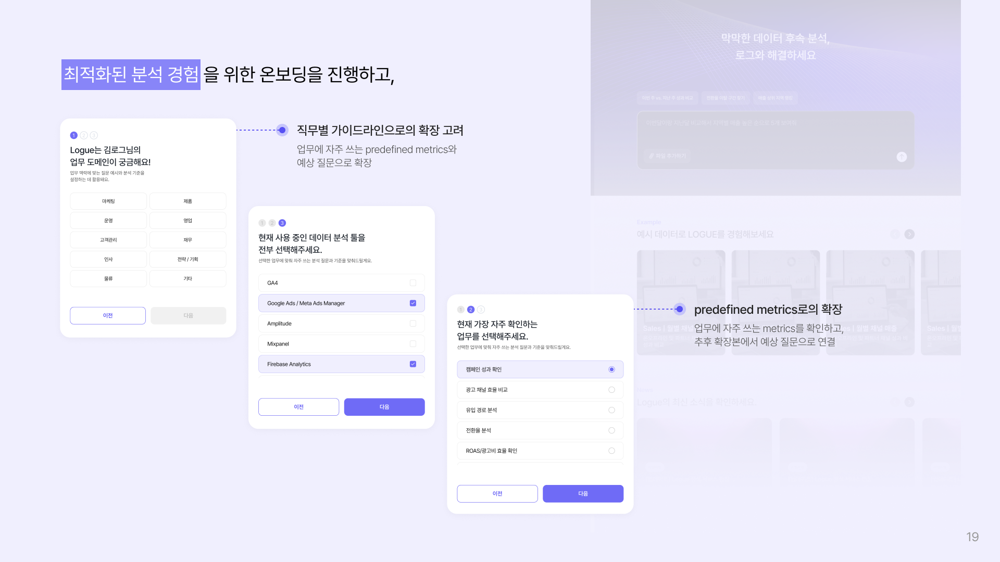
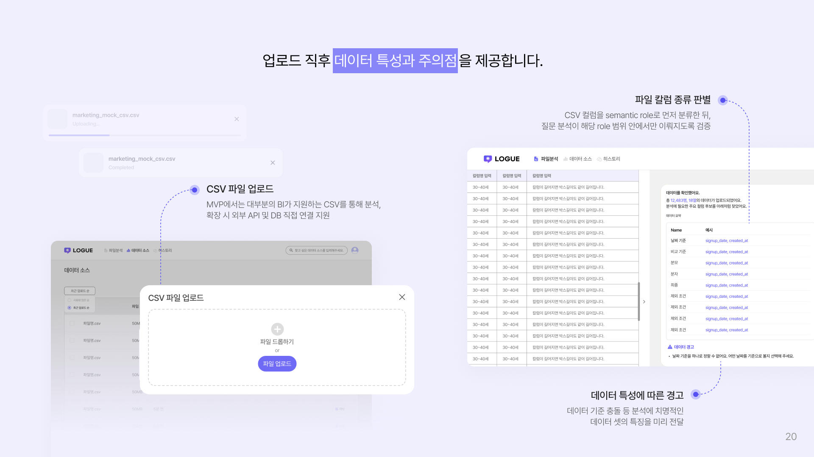
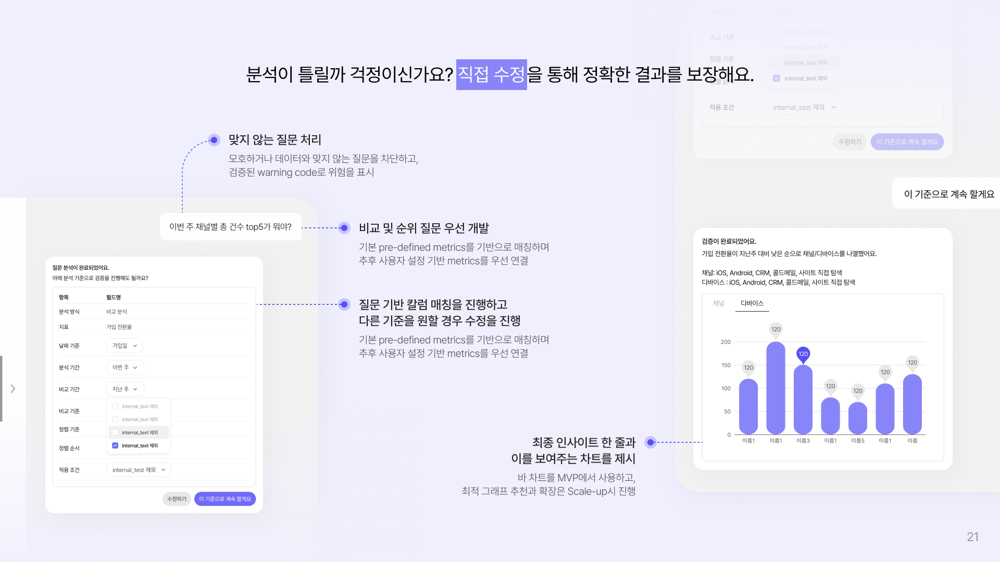
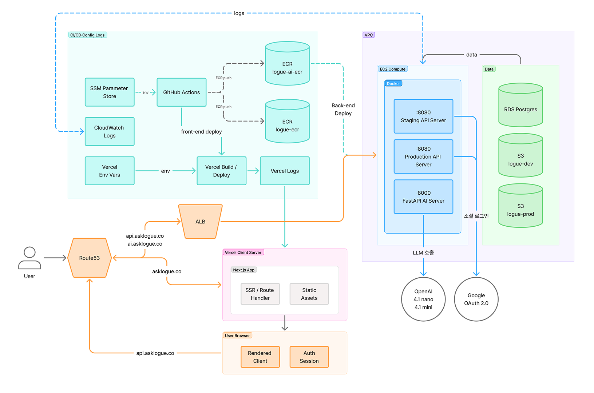

<div align="center">
  # Logue

  **데이터 분석이 어려운 실무자를 위한 자연어 기반 AI 분석 웹 서비스**

  Logue는 사용자의 모호한 질문을 분석 가능한 기준으로 구조화하고, CSV 데이터에서 신뢰할 수 있는 결과와 계산 근거를 함께 제공하는 분석 지원 서비스입니다.

  [배포 링크](https://asklogue.co) · [시연 영상](https://www.youtube.com/channel/UCJlg-nOFnb5ouBXR9MfhFwg) · [빠른 시작](#-빠른-시작) · [기여 가이드](CONTRIBUTING.md)
</div>

<br />



<br />

## 🧭 Overview

현업 실무자는 성과를 설명하고 다음 액션을 정하기 위해 데이터를 확인해야 하지만, 실제 업무에서는 데이터가 여러 도구와 파일에 흩어져 있고 질문을 SQL, BI 필터, 분석 조건으로 번역하는 과정이 병목이 됩니다.

Logue는 이 문제를 **Question-first 분석 경험**으로 해결합니다. 사용자는 자연어로 질문하고, 서비스는 질문에 필요한 지표, 기간, 그룹 기준, 필터를 먼저 구조화한 뒤 분석 결과와 기준을 함께 보여줍니다.

| Logue가 집중하는 문제 | 제품 접근 방식 |
| --- | --- |
| 질문을 BI 조건으로 직접 번역해야 함 | 자연어 질문을 분석 가능한 구조로 변환 |
| 기준일, 지표 정의가 흔들리면 결과 신뢰가 낮아짐 | 분석 기준을 명시적으로 노출하고 수정 가능하게 설계 |
| 모호한 질문이 잘못된 결과로 이어질 수 있음 | 데이터 특성과 질문의 충돌을 경고하고 확인 흐름 제공 |
| 숫자만 보고 계산 근거를 알기 어려움 | 결과와 함께 계산 기준, 해석 구조, 시각화를 제공 |

## 🔗 Demo & Links

| 구분 | 링크 |
| --- | --- |
| 배포 서비스 | [asklogue.co](https://asklogue.co) |
| 시연 영상 | [Logue YouTube 채널](https://www.youtube.com/channel/UCJlg-nOFnb5ouBXR9MfhFwg) |
| 시연 가이드 | [self_demo.md](self_demo.md) |
| 샘플 CSV | [docs/logue_analysis_sample.csv](docs/logue_analysis_sample.csv) |

## ✨ Product Highlights

| 기능 | 설명 |
| --- | --- |
| 자연어 질문 입력 | 실무자가 궁금한 내용을 자연어로 입력합니다. |
| 질문 분석 기준 도출 | `analysis_type`, `metric_id`, `date_field`, `group_by`, `filters` 등으로 질문을 구조화합니다. |
| CSV 업로드 분석 | 별도 DB 연결 없이 업로드한 CSV를 기준으로 분석을 시작합니다. |
| 스키마 의미 매핑 | 컬럼명이 달라도 날짜, 지표, 분류 기준 등 의미 단위로 역할을 추론합니다. |
| 모호성 감지 | 날짜 기준 충돌, 데이터 특성 불일치, 지원 범위 이탈을 경고합니다. |
| 기준 확인 및 수정 | 사용자가 분석 기준을 확인하고 필요한 경우 직접 수정할 수 있습니다. |
| 결과 시각화 | 분석 결과를 표, 차트, 한 줄 인사이트와 함께 제공합니다. |

## 📌 2026.06 기준 지원 범위

| 항목 | 현재 상태 |
| --- | --- |
| 적용 도메인 | 마케팅/CRM 기준 predefined metrics 적용 중 |
| 지원 지표 | `total_count`, `conversion_rate` 중심 |
| 지원 분석 유형 | `comparison`, `ranking`만 지원 중 |
| 데이터 입력 | CSV 업로드 기반 분석 지원 |

## 🌱 확장 전략

Logue는 현재 MVP의 CSV 기반 질문 분석 흐름을 바탕으로, 분석 기능과 적용 대상을 단계적으로 넓혀갈 계획입니다.

### 기능 확장

| 단계 | 방향 | 주요 내용 |
| --- | --- | --- |
| 01 | 조직 기준 / Metric Registry | 지표 정의 저장 및 버전 관리, 팀 단위 승인/공유, raw data 보안 관리 |
| 02 | 반복 분석 & 리포트화 | 이전 결과와 자동 비교, 결과 PDF/이미지/CSV export, 반복 리포트 템플릿화 |
| 03 | 분석 범위 / 연결 확장 | 분석 및 경고 유형 추가, 외부 데이터 채널/DB 연결, 기준 컬럼 매칭 및 추천 질문 최적화 |

### 타겟 확장

| 단계 | 방향 | 주요 내용 |
| --- | --- | --- |
| 01 | 도메인 확장 | 1차 마케팅/그로스/세일즈/CS/운영, 2차 HR/재무/PM, 업종별 분석 템플릿 제공 |
| 02 | 조직 레벨 확장 | 개인 실무자의 셀프 분석 지원, 팀 리더의 기준 공유/리포트 관리, C-level 핵심 KPI 요약 지원 |
| 03 | 조직 규모 확장 | 개인/소규모 팀의 CSV 분석 도구, 중소기업의 반복 리포트 대체, 엔터프라이즈 사내 기준 확장 |

## 🧩 User Flow

1. 사용자가 온보딩에서 직무와 자주 쓰는 분석 도구를 선택합니다.
2. CSV 파일을 업로드하면 Logue가 컬럼 특성과 주의점을 먼저 분석합니다.
3. 사용자가 자연어 질문을 입력합니다.
4. Logue가 질문을 분석 기준으로 변환하고 사용자에게 확인을 요청합니다.
5. 사용자가 기준을 확정하거나 수정하면 결과를 표, 차트, 설명으로 확인합니다.



<br />



<br />



## 🏗 System Architecture

Logue는 프론트엔드, 백엔드, AI 서버를 분리해 사용자 경험, 서비스 흐름 제어, LLM 기반 분석 기준 도출을 각각 담당하도록 설계되어 있습니다.

| 영역 | 역할 | 핵심 책임 |
| --- | --- | --- |
| Frontend | 사용자 인터페이스 | 질문 입력, CSV 업로드, 기준 확인, 결과 표/차트 표시 |
| Backend | 서비스 API 및 분석 흐름 제어 | 인증, 데이터 소스 관리, 분석 작업 상태 관리, AI 서버 연동 |
| AI | 질문/파일 분석 LLM 서비스 | CSV 컬럼 역할 분석, 질문 기준 구조화, 결과 요약 생성 |
| Infra | 배포 및 운영 | Vercel, EC2, ECR, RDS, S3, CloudWatch, GitHub Actions 기반 운영 |



## 📁 프로젝트 구조

```text
logue/
├── apps/
│   ├── fe/          Next.js 16 · TypeScript · Tailwind CSS
│   ├── be/          Spring Boot 3.5 · Java 21 · PostgreSQL · Redis
│   └── ai/          FastAPI · Python 3.11 · uv
├── assets/          README, 서비스 소개 이미지
├── docs/            기획 및 시연 문서
├── .github/         CI/CD · Issue/PR 템플릿 · CODEOWNERS
├── Makefile         루트 단축 명령
└── CONTRIBUTING.md  브랜치 전략 · 커밋 컨벤션
```

## 🛠 기술 스택

### Frontend

| 역할 | 종류 |
| ---- | ---- |
| Framework |   |
| Language |  |
| Styling |  |
| UI Documentation |  |
| Data Fetching |   |
| Visualization / Motion |   |
| Testing |   |
| Formatting |   |
| Package Manager |  |

### Backend

| 역할 | 종류 |
| ---- | ---- |
| Language / Framework |    |
| Persistence / Storage |      |
| Security |    |
| Documentation |  |
| Build / Tooling |    |
| Observability / Logging |    |
| Testing |   |
| Infra / CI-CD |       |

### AI

| 역할 | 종류 |
| ---- | ---- |
| Language / Framework |   |
| LLM Client |   |
| Validation / Schema |  |
| HTTP / Server |   |
| Testing |  |
| Package Manager |  |
| Optional ML Extra |   |
| Infra / CI-CD |       |

### Common

| 역할 | 종류 |
| ---- | ---- |
| Version Control |   |

## 🚀 빠른 시작

```bash
git clone https://github.com/26-ewha-capstone-logue/logue.git
cd logue
```

| 앱 | 개발 서버 | 테스트 | 빌드 |
| :--: | :-- | :-- | :-- |
| **FE** | `make dev-fe` | `make test-fe` | `make build-fe` |
| **BE** | `make dev-be` | `make test-be` | `make build-be` |
| **AI** | `make dev-ai` | `make test-ai` | `make build-ai` |

각 앱의 상세 실행 환경은 [CONTRIBUTING.md](CONTRIBUTING.md)와 앱별 README를 참고하세요.

| 앱 | 상세 문서 | 기본 포트 |
| --- | --- | --- |
| Frontend | [apps/fe/README.md](apps/fe/README.md) | `3000` |
| Backend | [apps/be/README.md](apps/be/README.md) | `8080` |
| AI | [apps/ai/README.md](apps/ai/README.md) | `8000` |

## 🧪 테스트 범위

Logue MVP는 모든 자유 질의를 처리하는 범용 분석기가 아니라, 실무에서 반복적으로 쓰이는 비교와 순위형 질문을 안정적으로 해석하는 데 집중합니다.

| 검증 관점 | 주요 확인 내용 |
| --- | --- |
| 정상 케이스 | 명확한 질문에서 분석 타입, 지표, 기간, 그룹 기준을 올바르게 도출 |
| 표현 다양화 | 같은 의도를 다른 표현으로 입력해도 일관된 기준을 반환 |
| 스키마 변화 | CSV 컬럼명이 달라도 의미 기준으로 매핑 |
| 실패/모호성 처리 | 애매한 상황에서 억지 추론 대신 경고와 수정 흐름 제공 |
| 결과 설명 | 확정된 기준과 집계 결과를 기반으로 사용자에게 읽히는 설명 생성 |

## 🌿 협업 컨벤션

```text
main ← 프로덕션 배포
 └── dev ← 통합 개발 (PR 타겟)
      ├── feat/fe/#이슈번호-설명
      ├── feat/be/#이슈번호-설명
      ├── feat/ai/#이슈번호-설명
      └── docs/#이슈번호-설명
```

- 기능, 버그 수정, 문서 작업은 `dev`로 PR을 올립니다.
- 커밋 메시지는 `prefix: 한국어 설명` 형식을 따릅니다.
- 자세한 브랜치 전략과 커밋 컨벤션은 [CONTRIBUTING.md](CONTRIBUTING.md)를 참고하세요.

## 👥 Team

|  |  |  |
| :--: | :--: | :--: |
| **손하늘** | **김겨레** | **민지인** |
| 기획 · Frontend | Backend · AI | Backend · AI |
| [@maetelson](https://github.com/maetelson) | [@gyesswhat](https://github.com/gyesswhat) | [@jxxxxxn](https://github.com/jxxxxxn) |

<br />

<div align="center">
  <sub>이화여자대학교 캡스톤디자인 2026 · Team Logue</sub>
</div>
