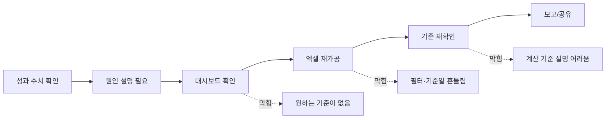
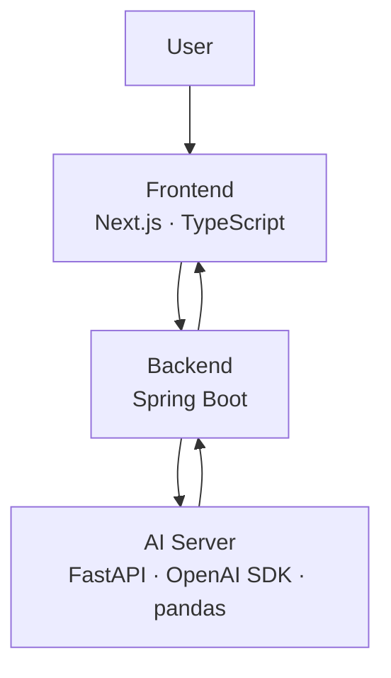

# Logue

## 자연어 질문을 분석 가능한 조건으로 바꾸는 Question-first 분석 지원 서비스

| 한 줄 정의 |
| --- |
| Logue는 마케팅·기획·운영 실무자의 자연어 질문을 지표 정의, 기준일, 비교 기간, 그룹 기준, 필터 조건으로 구조화하고, CSV 기반 분석 결과와 계산 기준을 함께 제공하는 분석 지원 서비스입니다. |

---

# 1. 문제 — 고객, Pain Point / Vitamin

## 성과를 설명해야 하는 실무자는 많지만, 질문은 바로 분석 조건이 되지 않습니다

| Target User | 주요 업무 | 반복 질문 |
| --- | --- | --- |
| 마케팅 실무자 | 캠페인·채널 성과 확인 | 어느 채널에서 전환율이 떨어졌지? |
| 기획 실무자 | 서비스 지표 변화 설명 | 이번 주 수치가 왜 변했지? |
| 운영 실무자 | 세그먼트별 성과 점검 | 어떤 조건에서 문제가 커졌지? |

## 현재 업무 흐름의 병목

## Pain Point 구조

| 업무 상황 | 표면적 행동 | 실제 병목 |
| --- | --- | --- |
| 대시보드 확인 | 화면에서 지표를 찾음 | 원하는 기준으로 쪼개 보기 어려움 |
| 엑셀 재가공 | CSV를 내려받아 직접 계산 | 기준일·필터·지표 정의가 흔들림 |
| 데이터팀 요청 | 질문을 다시 정리해 전달 | 자연어 질문을 분석 조건으로 바꿔야 함 |
| 결과 공유 | 숫자를 보고서에 붙임 | 계산 기준을 설명하기 어려움 |

## Painkiller / Vitamin 구분

| 구분 | 예시 기능 | 업무 영향 |
| --- | --- | --- |
| Vitamin | 예쁜 차트, 자동 요약, 리포트 생성 | 편의성 개선 |
| Painkiller | 질문 구조화, 계산 기준 확인, 모호성 감지 | 결과 신뢰와 공유 가능성 확보 |

---

# 2. 해결 아이디어

## 자연어 질문을 분석 조건으로 바꾸고, 결과와 계산 기준을 함께 제공합니다

### Before / After

| Before | After |
| --- | --- |
| “이번 주 가입 전환율이 왜 떨어졌지?” | 분석 가능한 조건으로 구조화 |
| 기준일을 직접 판단 | 기준일 후보를 명시 |
| 엑셀에서 직접 그룹화 | 채널·디바이스·유저 유형별 자동 비교 |
| 결과만 확인 | 결과 + 계산 기준 함께 확인 |

## 질문 변환 예시

| 사용자 질문 |
| --- |
| “이번 주 가입 전환율이 지난주 대비 어디에서 가장 많이 떨어졌어?” |

| 분석 조건 | Logue 해석 |
| --- | --- |
| 분석 유형 | ranking / comparison |
| 지표 | 가입 전환율 |
| 계산식 | signup_complete / landing_sessions |
| 기준일 | signup_date |
| 비교 기간 | 이번 주 vs 지난주 |
| 그룹 기준 | channel, device, user_type |
| 제외 조건 | internal_test 제외 |
| 정렬 기준 | 전환율 하락폭 기준 오름차순 |

## 서비스 흐름

## Logue가 제공하는 결과 단위

| 결과 영역 | 제공 내용 |
| --- | --- |
| 분석 결과 | 전환율, 변화량, 순위 |
| 기준 정보 | 지표 정의, 기준일, 비교 기간 |
| 그룹 정보 | channel, device, user_type |
| 필터 정보 | internal_test 제외 등 |
| 경고 정보 | 기준이 불명확한 경우 확인 요청 |

---

# 3. 기술 / 구현

## 사용자가 들으면 바로 떠올릴 수 있는 구현 흐름

## 시스템 구조

## 역할 분담

| 영역 | 담당 역할 | 핵심 산출물 |
| --- | --- | --- |
| Frontend | 질문 입력, CSV 업로드, 결과 화면 | 사용자 인터페이스 |
| Backend | 요청 처리, 파일 관리, 서버 연결 | API 흐름 제어 |
| AI Server | 질문 해석, 조건 생성, 모호성 판단 | 분석 조건 JSON |
| pandas | CSV 기반 계산 | 비교·순위 분석 결과 |

## 분석 조건 JSON 예시

| Key | Value |
| --- | --- |
| analysis_type | ranking |
| metric_id | signup_conversion_rate |
| metric_formula | signup_complete / landing_sessions |
| date_field | signup_date |
| period_standard | this_week |
| period_compare | last_week |
| group_by | channel, device, user_type |
| filter | account_flag != internal_test |
| sort_by | delta_conversion_rate |

## 구현 핵심

| 기술 요소 | 구현 내용 | 사용자 가치 |
| --- | --- | --- |
| Natural Language Parsing | 질문을 분석 조건으로 분해 | BI 조건을 직접 설계하지 않아도 됨 |
| Schema Mapping | CSV 컬럼의 의미를 매핑 | 컬럼명이 달라도 분석 가능 |
| Metric Grounding | 지표와 계산식 연결 | 계산 기준 확인 가능 |
| Ambiguity Handling | 애매한 기준 감지 | 임의 계산 방지 |
| Explainable Output | 결과와 기준 동시 출력 | 보고·공유 가능성 증가 |

---

# 4. MVP / 배포

## MVP는 반복성이 높은 두 가지 질문 유형에 집중합니다

| MVP 범위 | 포함 여부 | 설명 |
| --- | --- | --- |
| Comparison | O | 기간 간 지표 비교 |
| Ranking | O | 그룹별 변화량 순위화 |
| CSV 업로드 | O | 별도 DB 연결 없이 분석 |
| 계산 기준 노출 | O | 지표·기준일·필터 표시 |
| 모호성 경고 | O | 애매한 조건 확인 요청 |
| 모든 자유 질의 | X | 초기 범위에서 제외 |
| 실시간 DB 연동 | X | 초기 범위에서 제외 |

## MVP 사용자 흐름

## 화면 단위 산출물

| 화면 | 주요 기능 |
| --- | --- |
| 질문 입력 화면 | 자연어 질문 입력 |
| CSV 업로드 화면 | 분석 파일 업로드 |
| 분석 기준 확인 화면 | 지표, 기준일, 비교 기간, 필터 확인 |
| 결과 화면 | 표, 차트, 변화량 확인 |
| 기준 설명 화면 | 계산식과 조건 확인 |

## 배포 구조

| 구성 요소 | 배포 방식 |
| --- | --- |
| Frontend | Vercel 또는 AWS |
| Backend | AWS EC2 / Docker |
| AI Server | FastAPI 분리 배포 |
| Storage | CSV 임시 저장 후 결과 반환 |

## MVP 검증 기준

| 검증 항목 | 판단 기준 |
| --- | --- |
| 사용 가치 | comparison / ranking만으로도 쓸 이유가 있는가 |
| 시간 절감 | 엑셀 재가공 시간을 줄이는가 |
| 신뢰 확보 | 계산 기준 확인 부담을 줄이는가 |
| 공유 가능성 | 결과를 바로 설명 가능한 형태로 제공하는가 |

---

# 5. 차별성

## Logue는 BI, Excel, AI 챗봇 사이의 질문 구조화 구간을 겨냥합니다

| 비교 대상 | 강점 | 한계 | Logue의 차이 |
| --- | --- | --- | --- |
| BI 도구 | 정형 지표 조회 | 화면 밖 질문 대응 어려움 | 자연어 질문을 분석 조건으로 변환 |
| Excel | 자유로운 재가공 | 기준이 매번 흔들림 | 반복 질문을 구조화된 흐름으로 처리 |
| AI 챗봇 | 빠른 자연어 응답 | 계산 기준 신뢰 어려움 | 지표 정의와 계산 기준 노출 |
| NLQ 분석 서비스 | 자연어 질의 가능 | 모호성 검증 약함 | 기준일·필터·지표 충돌 감지 |

## 포지셔닝

| 축 | 기존 도구 | Logue |
| --- | --- | --- |
| 시작점 | 대시보드 메뉴, 데이터 테이블 | 실무자의 업무 질문 |
| 처리 단위 | 필터, 수식, 쿼리 | 분석 조건 JSON |
| 신뢰 방식 | 사용자가 직접 검증 | 계산 기준 자동 노출 |
| 핵심 사용자 | 분석가, 데이터 활용 숙련자 | 마케팅·기획·운영 실무자 |
| 초기 사용 사례 | 범용 분석 | comparison / ranking 반복 분석 |

## 차별화 요약

| Logue의 차별점 |
| --- |
| 자연어 질문을 분석 가능한 조건으로 바꾼다 |
| 결과와 계산 기준을 함께 보여준다 |
| 모호한 기준은 임의로 계산하지 않고 확인시킨다 |
| BI나 Excel 이전 단계의 질문 구조화 부담을 줄인다 |

---

# 6. 산학트랙 PMF / 고객 인터뷰

> 아래 내용은 MD 파일에는 포함하되, 발표에서는 제외합니다.

## PMF 검증 방향

| 검증 목표 | 확인할 내용 |
| --- | --- |
| 문제 반복성 | 동일한 분석·보고 문제가 반복되는가 |
| 현재 대안 | BI, Excel, 데이터팀 요청 중 무엇을 쓰는가 |
| 병목 지점 | 데이터 확인, 기준 정리, 결과 설명 중 어디가 어려운가 |
| MVP 적합성 | comparison / ranking만으로도 가치가 있는가 |
| 사용 의향 | 실제 업무 시간을 줄일 수 있다고 느끼는가 |

## 인터뷰 대상

| 대상 | 확인 목적 |
| --- | --- |
| 마케팅 실무자 | 전환율·채널 성과 분석 과정 확인 |
| 기획/운영 실무자 | 지표 변화 원인 파악 과정 확인 |
| 데이터 협업 경험자 | 데이터팀 요청 전후의 병목 확인 |

## 인터뷰 질문지

| 검증 항목 | 질문 |
| --- | --- |
| 문제 빈도 | 최근 2주 안에 수치를 직접 분석하거나 설명한 적이 있는가 |
| 현재 해결 방식 | 대시보드, 엑셀, 데이터팀 요청 중 무엇을 사용하는가 |
| 병목 지점 | 가장 오래 걸리는 단계는 무엇인가 |
| 신뢰 문제 | 결과 공유 전 계산 기준을 다시 확인하는가 |
| 대체 가능성 | Logue가 기준 구조화를 해준다면 기존 방식보다 나은가 |

## 인터뷰 결과 정리 양식

| 인터뷰 대상 | 확인된 Pain Point | 현재 대안 | Logue 적합성 |
| --- | --- | --- | --- |
| 마케팅 실무자 | 예: 채널별 전환율 하락 원인을 엑셀로 재가공 | BI + Excel | 높음 |
| 기획/운영 실무자 | 예: 기준일과 필터 조건을 매번 다시 확인 | 대시보드 + 수작업 | 중간~높음 |
| 데이터 협업 경험자 | 예: 데이터팀 요청 전 질문 정리가 어려움 | 슬랙/문서 요청 | 높음 |

## PMF 판단 기준

| 기준 | 통과 조건 |
| --- | --- |
| 문제 반복성 | 2~3명 중 2명 이상이 유사 문제를 반복 경험 |
| 기존 방식 불편함 | Excel/BI/데이터팀 요청에서 명확한 병목 확인 |
| MVP 적합성 | comparison / ranking 질문만으로도 사용 가치 확인 |
| 신뢰 필요성 | 계산 기준 확인 니즈가 반복적으로 등장 |
| 사용 의향 | 실제 업무 시간 절감 기대가 확인됨 |

## 작성 주의

| 주의사항 |
| --- |
| 실제 인터뷰 전에는 결과처럼 쓰지 않습니다 |
| 위 표는 인터뷰 설계 및 기록 양식입니다 |
| 발표 전 실제 응답 기반으로 Pain Point와 적합성을 업데이트합니다 |

---

# One-liner

| Logue |
| --- |
| 데이터 전문 인력이 아닌 실무자의 자연어 질문을 분석 가능한 조건으로 구조화하고, CSV 기반 분석 결과와 계산 기준을 함께 제공하는 Question-first 분석 지원 서비스 |
