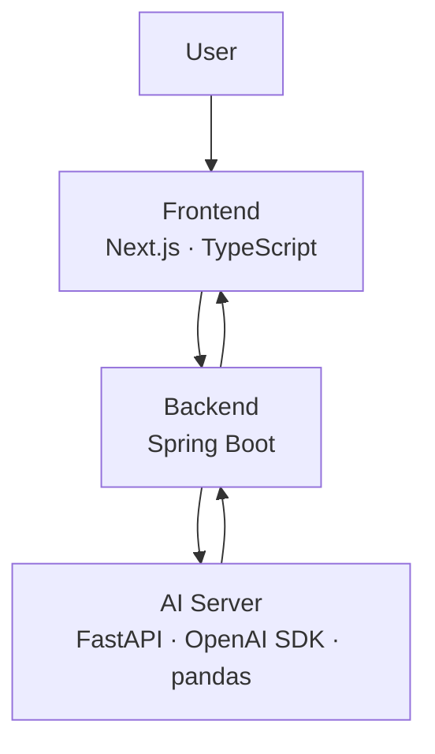

# Logue

## 자연어 질문을 분석 가능한 조건으로 바꾸는 Question-first 분석 지원 서비스

Logue는 마케팅·기획·운영 실무자의 자연어 질문을  
지표 정의, 기준일, 비교 기간, 그룹 기준, 필터 조건으로 구조화하고,  
CSV 기반 분석 결과와 계산 기준을 함께 제공하는 분석 지원 서비스입니다.

실무자는 대시보드나 엑셀에서 조건을 직접 조합하기 전에,  
자신의 질문이 어떤 기준으로 계산되어야 하는지 먼저 확인하고  
신뢰 가능한 형태로 결과를 해석할 수 있습니다.

---

# 1. 문제 — 고객, Pain Point / Vitamin

## 성과 수치를 설명해야 하는 실무자는 많지만, 질문을 분석 조건으로 바꾸는 과정은 여전히 어렵습니다

Logue의 핵심 고객은 데이터 분석가가 아니라,  
성과 수치의 변화를 보고 원인을 설명해야 하는 마케팅·기획·운영 실무자입니다.

이들은 “이번 주 전환율이 왜 떨어졌지?”, “어느 채널에서 성과가 가장 많이 변했지?”처럼  
업무상 필요한 질문은 명확히 갖고 있습니다.  
그러나 이 질문을 실제 분석 가능한 조건으로 바꾸는 과정에서 반복적으로 막힙니다.

| 업무 상황 | 실무자가 겪는 문제 |
| --- | --- |
| 대시보드 확인 | 보고 싶은 기준이 화면에 없으면 추가 가공이 필요함 |
| 엑셀 재가공 | 기준일, 지표 정의, 필터 조건이 매번 달라질 수 있음 |
| 데이터팀 요청 | 질문을 분석 요청서 수준으로 다시 정리해야 함 |
| 결과 공유 | 숫자가 어떤 기준으로 계산됐는지 설명하기 어려움 |

## 실무자의 병목은 데이터 접근 이후의 질문 구조화 단계에서 발생합니다

대시보드, 엑셀, CSV, 리포트는 이미 존재합니다.  
그럼에도 실무자가 매번 어려움을 겪는 이유는  
업무 질문이 곧바로 분석 조건으로 이어지지 않기 때문입니다.

| 구분 | 일반적인 기능 | 실무 관점의 한계 |
| --- | --- | --- |
| Vitamin | 예쁜 차트, 빠른 요약, 자동 리포트 | 있으면 편하지만 분석 기준이 흔들리면 결과를 신뢰하기 어려움 |
| Painkiller | 질문 구조화, 계산 기준 확인, 모호성 감지 | 결과를 설명하고 공유하기 위해 반드시 필요한 단계 |

Logue는 실무자가 숫자를 설명하기 전 반드시 확인해야 하는  
질문 구조화와 계산 기준 검증의 부담을 줄이는 데 집중합니다.

---

# 2. 해결 아이디어

## 자연어 질문에서 분석 조건을 추출하고, 결과와 계산 기준을 함께 제공합니다

Logue는 사용자가 자연어로 질문을 입력하면,  
질문 속에 포함된 지표, 기준일, 비교 기간, 그룹 기준, 필터 조건을 먼저 구조화합니다.

이를 통해 사용자는 BI 필터를 직접 조합하거나,  
엑셀에서 매번 기준을 다시 잡거나,  
데이터팀에 요청하기 위해 질문을 재정리하는 과정을 줄일 수 있습니다.

## 사용자 질문 예시

> “이번 주 가입 전환율이 지난주 대비 어디에서 가장 많이 떨어졌어?”

## Logue가 변환하는 분석 구조

| 항목 | 해석 예시 |
| --- | --- |
| 분석 유형 | ranking / comparison |
| 지표 | 가입 전환율 |
| 계산식 | signup_complete / landing_sessions |
| 기준일 | signup_date 또는 created_at |
| 비교 기간 | 이번 주 vs 지난주 |
| 그룹 기준 | channel, device, user_type |
| 필터 | internal_test 제외 |

## 서비스 흐름


Logue는 자연어 질문을 신뢰 가능한 분석 구조로 바꾸고,  
결과가 어떤 기준으로 계산됐는지 함께 보여줍니다.

사용자는 결과값만 확인하는 것이 아니라  
지표 정의, 기준일, 비교 기간, 필터 조건까지 함께 검토할 수 있습니다.

---

# 3. 기술 / 구현

## 질문 해석부터 분석 실행까지 하나의 흐름으로 연결합니다

Logue는 프론트엔드에서 질문과 CSV를 입력받고,  
백엔드가 분석 요청 흐름을 제어하며,  
AI 서버가 자연어 질문을 구조화하고 Python 기반 분석을 수행하는 구조로 구현됩니다.

## 전체 구현 흐름


## 사용자가 경험하는 화면 흐름


## 시스템 구조



| 영역 | 역할 |
| --- | --- |
| Frontend | 질문 입력, CSV 업로드, 분석 기준 확인, 결과 화면 제공 |
| Backend | 요청 처리, 파일 관리, 분석 실행 흐름 제어 |
| AI Server | 자연어 질문 해석, 분석 조건 구조화, 모호성 판단, pandas 기반 계산 |
| CSV Storage | 업로드 파일 임시 저장 및 분석 후 결과 반환 |

## AI 서버가 생성하는 구조화 출력 예시

```json
{
  "analysis_type": "ranking",
  "metric_id": "signup_conversion_rate",
  "metric_type": "ratio",
  "metric_formula": "signup_complete / landing_sessions",
  "date_field": "signup_date",
  "period_standard": "this_week",
  "period_compare": "last_week",
  "group_by": ["channel", "device", "user_type"],
  "filters": [
    {
      "field": "account_flag",
      "operator": "!=",
      "value": "internal_test"
    }
  ],
  "sort_by": "delta_conversion_rate",
  "sort_direction": "asc",
  "limit": 5
}
```

## 구현의 핵심 요소

| 기술 요소 | 구현 내용 | 사용자 가치 |
| --- | --- | --- |
| Natural Language Parsing | 자연어 질문을 분석 조건 단위로 분해 | 사용자가 BI 조건을 직접 설계하지 않아도 됨 |
| Schema-aware Mapping | CSV 컬럼을 date, measure, dimension, flag 등 의미 기준으로 매핑 | 컬럼명이 달라도 분석에 필요한 역할을 파악할 수 있음 |
| Metric Grounding | 지표를 계산식과 연결 | 전환율, 증감률 등 주요 지표의 계산 기준을 명확히 확인할 수 있음 |
| Ambiguity Handling | 기준일·지표·필터가 불명확할 때 경고 | 임의 계산 대신 확인이 필요한 지점을 먼저 드러냄 |
| Explainable Output | 결과와 계산 기준을 함께 출력 | 보고 전 기준 검증과 공유가 쉬워짐 |

---

# 4. MVP / 배포

## 초기 MVP는 실무 반복성이 높은 두 가지 분석 질문에 집중합니다

Logue의 MVP는 초기부터 모든 자유 질의를 처리하는 범용 분석기를 목표로 하지 않습니다.  
실무자가 반복적으로 사용하는 comparison과 ranking 질문을 먼저 해결합니다.

기능 범위를 좁히는 이유는 명확합니다.  
반복 빈도가 높고, 기준 검증 부담이 큰 질문 유형에서  
가장 빠르게 사용 가치를 확인할 수 있기 때문입니다.

## MVP 범위

| MVP 기능 | 내용 |
| --- | --- |
| Comparison | 이번 주 vs 지난주, 이번 달 vs 지난달처럼 기간 간 지표 비교 |
| Ranking | 어느 채널, 디바이스, 세그먼트에서 가장 많이 변했는지 순위화 |
| CSV 분석 | 별도 DB 연결 없이 사용자가 업로드한 CSV 기반 분석 |
| 기준 노출 | 지표 정의, 기준일, 비교 기간, 필터 조건 표시 |
| 모호성 경고 | 기준이 애매할 경우 임의 계산 대신 확인 요청 |
| 결과 출력 | 표, 간단한 차트, 계산 기준 설명 제공 |

## MVP에서 제공되는 사용자 경험


## 사용자가 최종적으로 확인하는 결과

| 출력 영역 | 제공 내용 |
| --- | --- |
| 분석 결과 | 전환율, 증감률, 순위, 비교 결과 |
| 결과 표 | 그룹 기준별 수치와 변화량 |
| 시각화 | 기간 비교 또는 순위 기반 간단한 차트 |
| 계산 기준 | 지표 정의, 기준일, 비교 기간, 필터 조건 |
| 경고 메시지 | 기준이 불명확하거나 컬럼 매핑이 애매한 경우 확인 요청 |

## 배포 구조

| 영역 | 배포 방식 |
| --- | --- |
| Frontend | Vercel 또는 AWS 기반 웹 배포 |
| Backend | AWS EC2 / Docker 기반 배포 |
| AI Server | FastAPI 서버로 분리 배포 |
| Storage | CSV 파일 임시 저장 및 분석 후 결과 반환 |

## MVP 검증 방향

MVP의 목적은 가능한 많은 질문에 답하는 것이 아니라,  
반복 질문 2종에서 실무자의 분석 준비 시간을 줄이고  
결과를 더 신뢰 가능한 형태로 공유할 수 있는지를 확인하는 것입니다.

---

# 5. 차별성

## Logue는 BI, Excel, AI 챗봇 사이에 남아 있는 질문 구조화 구간을 겨냥합니다

기존 도구들은 각자 강점이 있습니다.  
BI는 정형화된 지표 조회에 강하고, Excel은 자유로운 재가공에 유리하며,  
AI 챗봇은 자연어 기반 응답 속도가 빠릅니다.

그러나 실무자의 업무 질문을 분석 가능한 조건으로 바꾸고,  
그 계산 기준까지 검증 가능하게 보여주는 영역은 여전히 비어 있습니다.

| 비교 대상 | 기존 방식 | 한계 | Logue의 차이 |
| --- | --- | --- | --- |
| BI 도구 | 사용자가 직접 필터와 조건을 설정 | 조건을 설계할 줄 알아야 하고, 화면 밖 질문은 대응이 어려움 | 자연어 질문을 분석 조건으로 자동 구조화 |
| Excel | CSV를 직접 재가공 | 기준일, 지표 정의, 필터가 매번 흔들릴 수 있음 | 반복 질문을 구조화된 분석 흐름으로 처리 |
| AI 챗봇 | 자연어로 빠르게 답변 생성 | 계산 기준이 불명확하면 결과 신뢰가 낮아짐 | 지표 정의와 계산 기준을 명시적으로 노출 |
| NLQ 분석 서비스 | 자연어 질의응답 중심 | 빠른 응답에 집중할수록 모호성 검증이 약해질 수 있음 | 모호성 감지와 기준 검증에 집중 |

## Logue의 포지션

| 관점 | Logue의 방향 |
| --- | --- |
| 시작점 | 대시보드 메뉴가 아니라 사용자의 업무 질문 |
| 처리 방식 | 자연어 질문을 분석 가능한 JSON 구조로 변환 |
| 신뢰 확보 | 계산 기준, 기준일, 필터 조건을 함께 제시 |
| 사용 대상 | 데이터 분석가가 아닌 마케팅·기획·운영 실무자 |
| 초기 범위 | comparison / ranking 중심의 반복 분석 질문 |

## 경쟁 서비스와 다른 지점

Logue는 실무자가 BI, Excel, 데이터팀 요청으로 넘어가기 전  
자신의 질문을 정리하고 계산 기준을 검증할 수 있도록 돕는  
앞단의 분석 지원 레이어입니다.

핵심 차별점은 자연어 입력 그 자체가 아니라,  
자연어 질문을 신뢰 가능한 분석 구조로 변환하고  
결과와 함께 계산 기준을 드러내는 방식에 있습니다.

---

# 6. 산학트랙 PMF / 고객 인터뷰

> 아래 내용은 MD 파일에는 포함하되, 발표에서는 제외합니다.

## 산학트랙에서는 제품 완성도보다 문제 반복성을 먼저 검증합니다

초기 단계에서 가장 중요한 것은  
제품을 완성하는 것이 아니라,  
이 문제가 실제 고객에게 반복적으로 발생하는지 확인하는 것입니다.

따라서 산학트랙에서는 2~3명의 핵심 고객 인터뷰를 통해  
문제 빈도, 현재 해결 방식, 병목 지점, MVP 적합성을 검증합니다.

## 인터뷰 대상

| 대상 | 인터뷰 목적 |
| --- | --- |
| 마케팅 실무자 | 전환율, 채널 성과, 캠페인 성과 분석 과정 확인 |
| 기획/운영 실무자 | 지표 변화 원인 파악과 보고 과정 확인 |
| 데이터 협업 경험자 | 데이터팀 요청 전후의 커뮤니케이션 병목 확인 |

## 인터뷰에서 확인할 내용

| 검증 항목 | 질문 |
| --- | --- |
| 문제 빈도 | 최근 2주 안에 수치를 직접 분석하거나 설명한 적이 있는가 |
| 현재 해결 방식 | 대시보드, 엑셀, 데이터팀 요청 중 무엇을 사용하는가 |
| 병목 지점 | 가장 오래 걸리는 단계가 데이터 확인인지, 기준 정리인지, 결과 설명인지 |
| 신뢰 문제 | 결과를 공유하기 전에 계산 기준을 다시 확인하는가 |
| 대체 가능성 | Logue가 질문 구조화와 기준 노출을 해준다면 기존 방식보다 나은가 |
| MVP 적합성 | comparison / ranking 질문만으로도 초기 사용 가치가 있는가 |

## 인터뷰 결과 정리 양식

| 인터뷰 대상 | 확인된 Pain Point | 현재 대안 | Logue 적합성 |
| --- | --- | --- | --- |
| 마케팅 실무자 | 예: 채널별 전환율 하락 원인을 엑셀로 재가공 | BI + Excel | 높음 |
| 기획/운영 실무자 | 예: 기준일과 필터 조건을 매번 다시 확인 | 대시보드 + 수작업 | 중간~높음 |
| 데이터 협업 경험자 | 예: 질문을 데이터팀에 전달하기 전 정리가 어려움 | 슬랙/문서 요청 | 높음 |

## PMF 판단 기준

| 기준 | 판단 방식 |
| --- | --- |
| 문제 반복성 | 동일한 분석·보고 문제가 주기적으로 발생하는가 |
| 기존 방식의 불편함 | Excel, BI, 데이터팀 요청으로 해결하는 데 시간이 많이 드는가 |
| 신뢰 필요성 | 결과 공유 전 계산 기준을 확인해야 하는 상황이 반복되는가 |
| 사용 의향 | 단순 호기심이 아니라 실제 업무 시간을 줄일 수 있다고 느끼는가 |
| MVP 적합성 | comparison / ranking 질문만으로도 초기 사용 가치가 있는가 |

## 인터뷰 결과 작성 시 주의사항

실제 인터뷰를 진행하지 않았다면 결과처럼 작성하면 안 됩니다.  
위 표는 인터뷰 설계 및 기록 양식으로 두고,  
발표 전 실제 응답을 기반으로 업데이트해야 합니다.

---

# One-liner

Logue는 데이터 전문 인력이 아닌 실무자의 자연어 질문을  
분석 가능한 조건으로 구조화하고,  
CSV 기반 분석 결과와 계산 기준을 함께 제공하는  
Question-first 분석 지원 서비스입니다.
