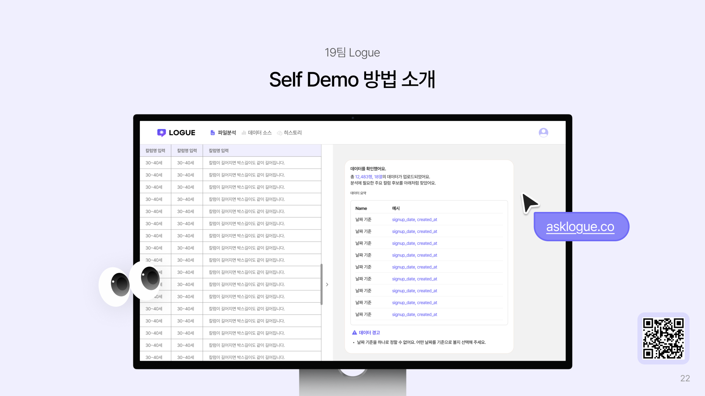
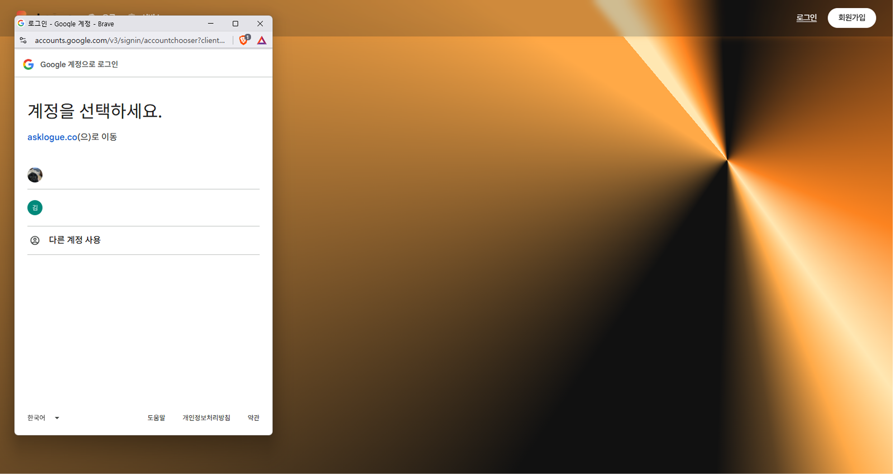
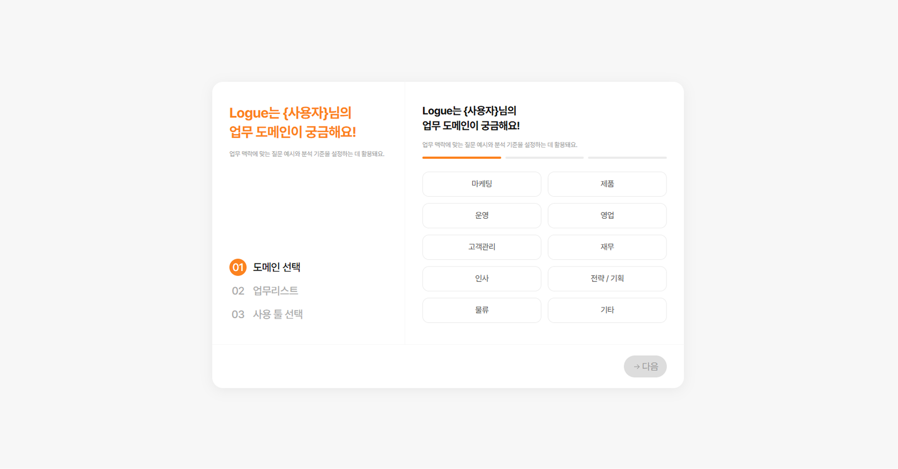
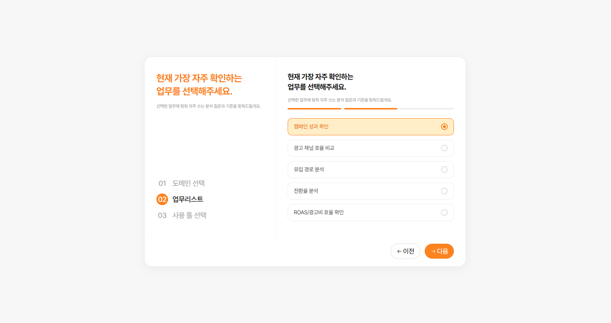
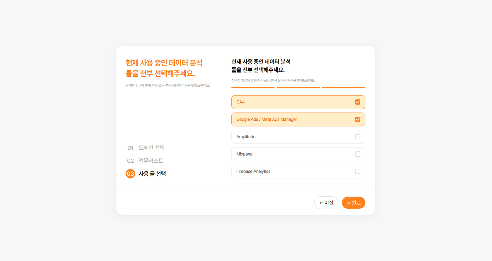
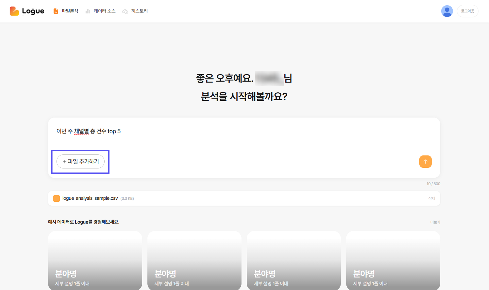
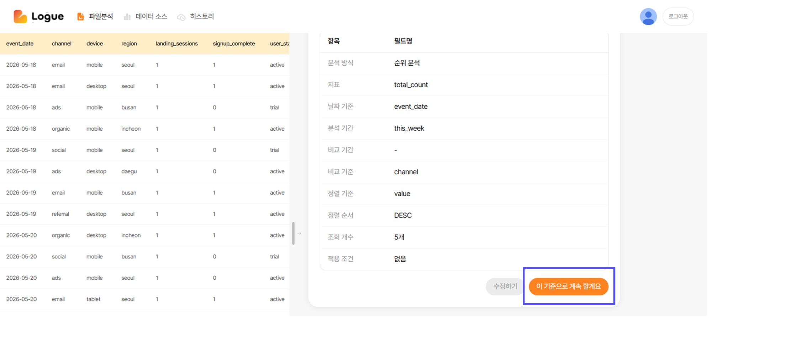
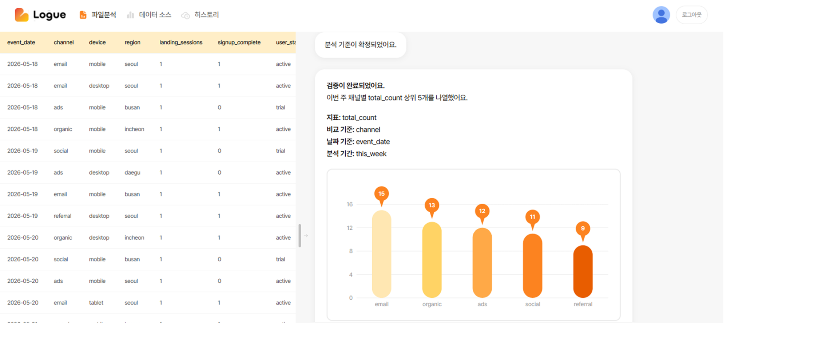

# self_demo 시연 가이드 🚀

Logue의 self_demo는 회원가입부터 온보딩, CSV 업로드, 질문 입력, 분석 기준 확인, 검증 결과 확인까지 이어지는 핵심 사용자 흐름을 보여줍니다.

## 시작 전 준비 🧭

- 🌐 시연 사이트: [asklogue.co](https://asklogue.co)
- 🎥 시연 영상: [Logue YouTube 채널](https://www.youtube.com/channel/UCJlg-nOFnb5ouBXR9MfhFwg)
- 📁 샘플 CSV: [logue_analysis_sample.csv](./logue_analysis_sample.csv)
- 💬 예시 질문: `이번 주 채널별 총 건수 top 5`

샘플 CSV 링크를 클릭한 뒤 파일을 다운로드해 주세요. GitHub에서 문서를 보고 있다면 CSV 화면의 **Download raw file** 버튼으로 저장하면 됩니다.

> **참고**
>
> 샘플 CSV가 아닌 다른 CSV를 업로드하고 질문해도 괜찮습니다. 다만 현재 Logue는 마케팅/CRM 도메인에 특화된 predefined metrics를 기준으로 분석을 지원하므로, 다른 도메인의 데이터는 질문 해석이나 분석 결과의 정확도가 떨어질 수 있습니다.

## 1. 회원가입 후 온보딩 진입 👋

시연 사이트에 접속한 뒤 회원가입 버튼을 눌러 온보딩으로 진입합니다.

온보딩에서는 각 단계의 질문에 맞춰 선택지를 고르고 다음 단계로 이동합니다. 이 시연에서는 온보딩 선택값보다 CSV 업로드 이후의 분석 흐름을 확인하는 것이 핵심입니다.

## 2. CSV 업로드 및 질문 입력 📁

위의 샘플 CSV를 다운로드한 뒤 업로드하고, 분석하고 싶은 질문을 입력합니다.

파일의 특성을 처음부터 알기 어려울 수 있으니, 아래 예시 질문으로 먼저 시연합니다.

> **예시 질문**
>
> 이번 주 채널별 총 건수 top 5

## 3. 분석 기준 확인 ✅

질문이 올바르게 분석되었는지 확인합니다. 아래 항목이 보이면 예시 질문이 의도대로 해석된 것입니다.

- 분석 방식: 순위 분석
- 지표: `total_count`
- 날짜 기준: `event_date`
- 비교 기준: `channel`
- 조회 개수: 5개

분석 기준이 의도와 맞다면 **"이 기준으로 계속 할게요"** 버튼을 눌러 다음 단계로 진행합니다.

## 4. 검증 결과 및 리포트 활용 📊

검증 결과를 확인하고, 분석 내용을 리포트에 활용해보세요.

결과 화면에서는 질문이 어떤 기준으로 해석되었는지와 실제 분석 결과를 함께 확인할 수 있습니다. 채널별 상위 5개 결과가 차트로 표시되면 self_demo 흐름이 정상적으로 완료된 것입니다.

