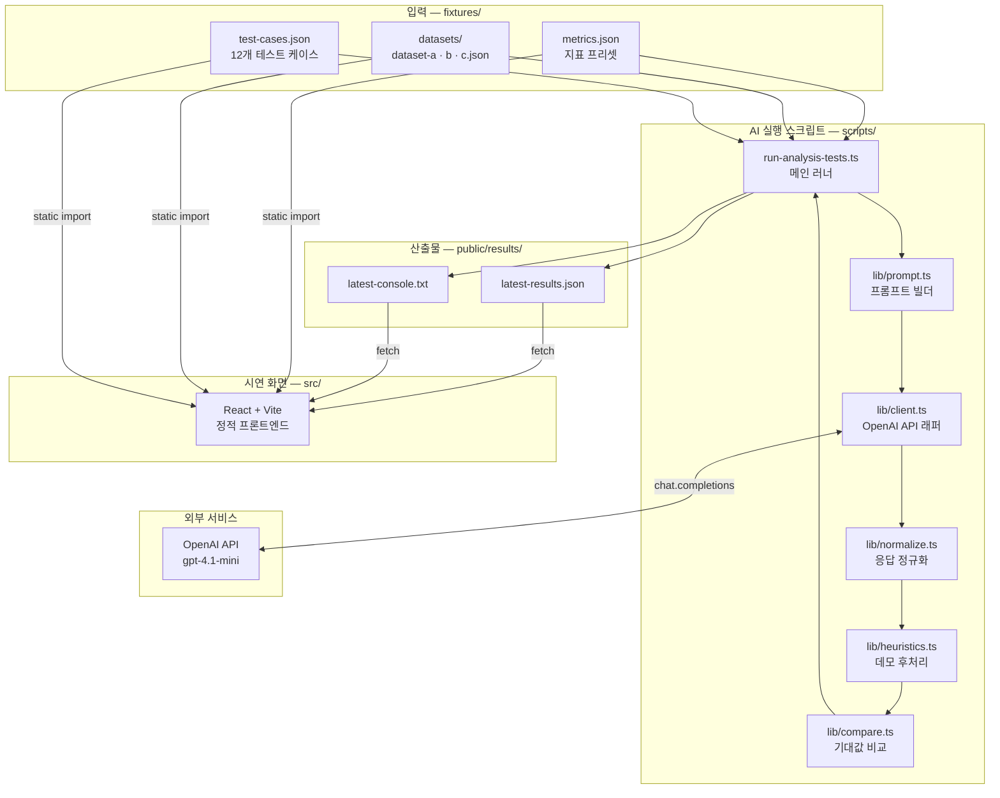
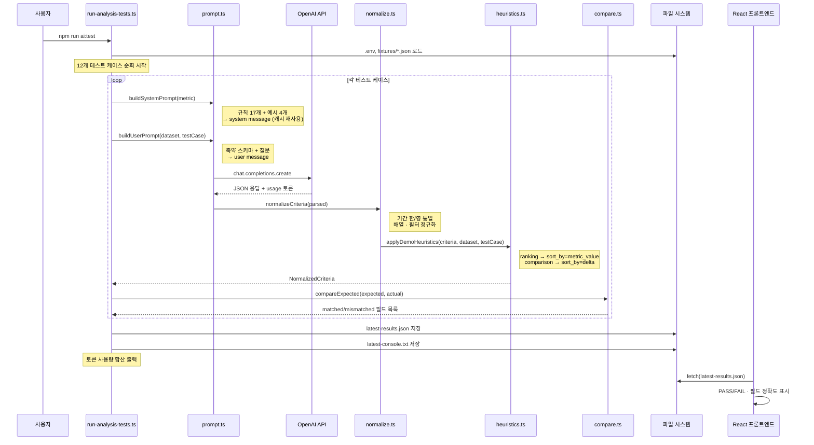
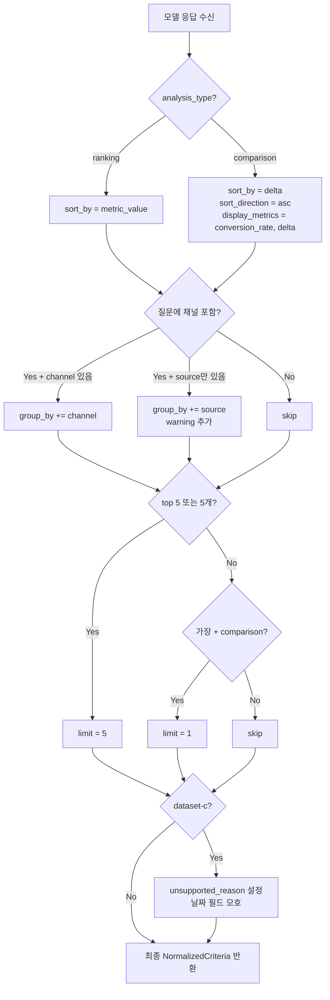

# Logue 심층 인터뷰

## 1️⃣ 팀 RnR

### 1. 기본 RnR ❤️

| 구분   | 업무                                                                                         | 담당자            |
| ------ | -------------------------------------------------------------------------------------------- | ----------------- |
| 기획   | 상위 기획, 와이어프레임 작업, 기능명세서 작업, PPT 작업                                      | 손하늘            |
| 디자인 | 브랜딩, GUI, UX 라이팅, UI/UX 디자인                                                         | 외부 인력, 손하늘 |
| FE     | 화면 구현, 사용자 인터랙션 처리, API 연동, 상태 관리, 테스트용 콘솔/데모 UI 구현             | 김예원            |
| BE     | API 설계 및 구현, 데이터 처리 및 저장 구조 설계, 서버 로직 관리, 인증 및 요청 처리           | 김겨레, 민지인    |
| AI     | LLM 프롬프트 설계, 라벨링/분석 로직 구현, 모델 호출 및 결과 구조화, 토큰 최적화 및 성능 개선 | 손하늘, 김예원    |

### 2. 심층 인터뷰 준비 RnR ❤️

| 구분                | 업무                                                 | 담당자                         |
| ------------------- | ---------------------------------------------------- | ------------------------------ |
| 설계                | 테스트 시나리오 및 구조 결정, 확장 기능 논의 및 구현 | 손하늘, 김겨레, 김예원, 민지인 |
| 데모 개발 구조화    | 시연용 AI 로직 구체화                                | 손하늘, 김겨레, 민지인         |
| 데모 개발           | 시연용 AI 로직 및 UI 개발                            | 손하늘                         |
| 데모 토큰 효율화    | 시연용 AI 로직 효율화                                | 김예원                         |
| 문서화 및 확장      | 각 파트 진행 사항 작성 및 MVP 기능 구현              | 손하늘, 김겨레, 김예원, 민지인 |
| 데모 시연           | 시연 진행, 테스트 설계 방안 설명                     | 손하늘                         |
| 코드 및 효율화 설명 | 코드 설명 및 토큰 사용 효율화 설명                   | 김예원                         |

## 2️⃣ 서비스 개요

> **Logue**는 실무자의 모호한 자연어 질문을 분석 가능한 구조로 변환하고, 계산 기준과 함께 결과를 제공하는 **Question-first 데이터 분석 지원 서비스**입니다.

### 문제 인식 💛

1. 상황 분석
   - 데이터 기반 의사결정이 마케팅·운영·기획 등 비분석 직군으로 빠르게 확산되고 있음
   - 데이터가 CRM, 광고 플랫폼, 웹 로그, 내부 운영 도구 등 여러 시스템에 분산되어 있어 실무자가 "어디에 어떤 데이터가 있는지"부터 파악해야 함
   - 기존 BI 도구는 대시보드 확인 이후에도 엑셀 재가공, 데이터팀 요청, 기준 확인 등 추가 작업이 반복되어 빠른 의사결정의 마지막 구간이 비효율적으로 남아 있음

2. 기업 분석
   - 기존 BI 서비스는 정형 리포트·모니터링에는 강하지만, "이번 주 전환율이 지난주 대비 어디에서 가장 많이 떨어졌어?" 같은 모호한 질문을 즉시 실행 가능한 분석 조건으로 전환하지 못함
   - 최근 자연어 기반 분석 서비스(Julia AI 등)도 지표 정의의 일관성, 계산 기준의 검증 가능성, 모호성 처리 측면에서 불안정한 경우가 많음
   - 단순히 답을 생성하는 것이 아니라, 조직이 신뢰할 수 있는 기준으로 질문을 해석하고 결과를 설명하는 경험이 부재함

3. 소비자 분석
   - 핵심 사용자는 데이터 전문 인력이 아닌, 숫자를 보고 설명해야 하는 **실무자** (마케팅·기획·운영 담당자)
   - 이들은 "무엇이 궁금한지"는 알지만, 그것을 SQL이나 BI 필터 조건처럼 분석 시스템이 이해하는 구조로 바꾸는 데 어려움을 겪음
   - 질문을 잘게 쪼개고, 기준일·지표 정의를 맞추고, 결과를 직접 검증하는 과정에서 시간과 신뢰가 동시에 소모됨

### 솔루션 (기획) 💛

**타겟** : 데이터 전문가가 아닌 현업 실무자 (마케팅·기획·운영·영업 직군)

#### 비즈니스 로직

1. 사용자가 자연어로 분석 질문을 입력
2. 시스템이 질문에서 필요한 지표·기준일·비교 기간·그룹 기준·필터를 해석하고 구조화
3. 해석된 분석 조건을 사용자에게 보여주고, CSV 업로드 또는 데이터 확인을 유도
4. 결과를 표·차트·설명과 함께 제공하며, 기준 수정이나 재질문을 지원

- BM : Freemium 모델 — 기본 질문 해석 무료 제공 후, 고급 분석·팀 협업·데이터 소스 연동 등 유료 전환
- GTM 전략 : 마케팅·기획 실무자가 많은 스타트업·중소 IT 기업 대상, 핵심 실패 시나리오 기반 비교 데모로 초기 사용자 확보

### 솔루션 (기술) ❤️

- **FE**
  - React 19 + Vite 6 기반 정적 프론트엔드
  - 질문 입력 → 분석 기준 확인 → 결과 시각화(표·차트·설명)의 흐름을 구현
  - 테스트 시연용 UI: 데이터셋 카드, 테스트 케이스 탭, 기대값 vs 실제값 비교, 필드별 정확도 테이블 제공
  - 저장된 `latest-results.json`을 fetch하여 결과를 표시하는 구조 (AI 실행과 시연 UI 분리)

- **⭐ BE**
  - Spring Boot 3.5 + Java 21 기반 API 서버로, 요청 처리·파일 관리·분석 실행 흐름 제어·결과 전달을 담당
  - 현재 테스트 단계에서는 백엔드 API 없이 로컬 스크립트로 AI를 직접 호출하는 구조이며, 향후 서비스 단계에서 BE가 FE ↔ AI 사이의 요청 라우팅, CSV 파일 저장(S3), 사용자 인증(OAuth 2.0 + JWT), 분석 이력 관리(PostgreSQL) 역할을 수행할 예정
  - AI API Call 관점: BE → AI 서버(FastAPI)로 질문·데이터셋 스키마를 전달하면, AI가 OpenAI API를 호출해 분석 조건 JSON을 반환하고, BE는 이 결과를 저장·가공하여 FE에 전달하는 구조

- **⭐ AI**
  - **사용 AI 서비스**: OpenAI Chat Completions API (`gpt-4.1-mini`)
  - **목적**: 사용자의 한국어 자연어 질문을 `AnalysisCriteria` JSON 구조로 변환 (분석 유형·지표·기준일·비교기간·그룹핑·정렬·필터·모호성 경고 포함)
  - **주요 파라미터**: `temperature: 0` (일관성 보장), `response_format: { type: "json_object" }` (순수 JSON 반환), system message에 metric preset·17개 규칙·4개 few-shot 예시 포함
  - **결과 활용**: 모델 출력 → `normalize.ts`로 기간 표현 한/영 통일·배열 정규화 → `heuristics.ts`로 반복 실수 패턴 보정 → `compare.ts`로 기대값 대비 필드별 정확도 산출
  - **토큰 최적화**: system/user message 분리로 prompt caching 활용, 스키마 축약(~40% 절감), 샘플 2행 제한 → 12케이스 1회 실행 약 **$0.006 (≈ 8원)**

### 확장 전략 💛

1. 타겟 확장 : 초기에는 마케팅·기획·운영 실무자를 대상으로 하되, 이후 재무·영업·CS·HR 등 비데이터 직군 전반의 셀프 분석 수요로 확장. 궁극적으로는 조직 내 누구나 자연어로 데이터에 질문하는 환경을 목표로 함.
2. 기술 솔루션 확장 :
   - **데이터 소스**: CSV 업로드 → SaaS 연동(Google Analytics, HubSpot 등) → 내부 DB 직접 연결
   - **분석 범위**: 비교·순위 → 추세 분석, 분포 분석, 세그먼트 비교, 지표 조합 분석
   - **신뢰성**: 조직별 metric registry·지표 사전 도입으로 질문 해석의 유연성과 결과 신뢰성 동시 확보
   - **BE 확장**: 분석 이력 저장·팀 공유 기능, 다중 데이터소스 커넥터 관리, 분석 결과 캐싱(Redis) 및 대용량 파일 처리 최적화

---

### 교수님 면담 결과 💛

**→ 비교 대상을 Julia AI 같은 단일 서비스로 고정해 그 서비스가 반복적으로 놓치는 질문 시나리오를 먼저 확보하고, 전범위 구현 대신 핵심 로직과 시연 UI에 집중하되, 연동 실패에 대비해 스태틱 대체 플랜까지 준비하는 것이 데모 성공 확률을 가장 높인다.**

| 피드백 항목        | 교수님 코멘트                                                                                                           | 시사점                                                                                               |
| ------------------ | ----------------------------------------------------------------------------------------------------------------------- | ---------------------------------------------------------------------------------------------------- |
| 비교 대상 명확     | 기존 BI, ChatGPT, 내부 데이터팀 등 여러 비교축을 동시에 잡지 말고 Julia AI 같은 단일 서비스로 명확히 좁힐 것            | 경쟁 구도가 흐리면 데모 메시지가 약해진다. 한 서비스의 실패 지점을 먼저 고정해야 차별점이 선명해진다 |
| 실패 케이스 선확보 | 경쟁 서비스가 반복적으로 해결하지 못하는 질문·상황을 먼저 확보하고, 같은 시나리오에서 우리 서비스가 되는 것을 보여줄 것 | 개발 전에 비교 기준이 없으면 ‘이미 남들도 되는 기능’을 뒤늦게 구현할 위험이 크다                     |
| MVP 범위 축        | FE, API, AI, 액션 엔진을 모두 완성하려 하기보다 인프라는 최대한 기존 도구를 활용하고 핵심 로직에 집중할 것              | 프로젝트 성패는 핵심 기능을 끝까지 보여주는 데 달려 있다                                             |
| Plan B/C 준비      | 시스템 연결이 불안정하면 차트나 일부 결과는 스태틱·임의 데이터로 대체하는 플랜을 미리 준비할 것                         | 최종 데모는 완전성보다 실패하지 않는 시연 구조가 더 중요하다                                         |

## 3️⃣ 테스트 설계 💛

### 1) 기술적으로 challenging한 부분

| 구분               | WHY                                                                                           |
| ------------------ | --------------------------------------------------------------------------------------------- |
| 질문 해석          | 같은 질문도 사람마다 의미가 다르고, CSV마다 대응되는 컬럼이 다름                              |
| 스키마 불확실성    | DB처럼 고정된 schema가 없어서 파일마다 컬럼명, 값 체계, 날짜 기준이 다름                      |
| metric grounding   | “가입 전환율” 같은 비즈니스 지표를 어떤 컬럼 조합으로 계산할지 안정적으로 잡아야 함           |
| ambiguity handling | `signup_date`와 `created_at` 중 어떤 날짜를 쓸지 같은 모호성을 감지하고 수정 가능하게 해야 함 |
| consistency        | 같은 질문에 매번 다른 기준으로 답하면 제품이 아니라 데모로밖에 못 씀                          |

### 2) 실험한 부분

#### 0. 전제

- 백엔드 API X
- OpenAI API를 직접 호출하는 로컬 스크립트만 구현
- 스크립트는 콘솔 출력 + 결과 JSON 파일 저장
- FE는 그 저장된 JSON을 읽어서 테스트셋/케이스/결과를 보여주는 정적 페이지

→ AI 실행은 콘솔, 시연은 FE로 분리

#### 1. 테스트 케이스 선정

> 타겟 소비자가 많이 하는 질문 중 하나인 **비교·순위형** 형태의 질문을 중심으로, **표현 변화·스키마 차이·모호성 상황**에서도 분석 기준이 **일관되게 도출**되는지 검증했다.

### 3) 테스트 설계

> 성격이 다른 data set 3개를 통해 주요 해석 지표인 `비교`와 `순위` 질문 두 개에 대해 제대로 된 값을 출력하는지 확인한다.

#### 1. 검증 여부

| 검증 대상                                | 테스트 포함 여부 | 이유                                               |
| ---------------------------------------- | ---------------- | -------------------------------------------------- |
| `analysis_type` 도출                     | ⭕               | **comparison / ranking**을 주요 해석 지표로 지정함 |
| `metric_id` 도출                         | ⭕               | 질문의 중심 지표를 잘못 잡으면 전부 무너짐         |
| `date_field` 도출                        | ⭕               | 기준일 충돌은 핵심 리스크                          |
| `period_standard`, `period_compare` 도출 | ⭕               | 비교 질문 핵심                                     |
| `group_by` 도출                          | ⭕               | “어디에서”를 못 잡으면 차별점이 사라짐             |
| `sort_by`, `sort_direction` 도출         | ⭕               | ranking/comparison 차이가 여기서 드러남            |
| `limit` 도출                             | ⭕               | top n 질문 핵심                                    |
| `filters` 도출                           | ⭕               | `internal_test 제외` 같은 조건 반영 필요           |
| 차트/표 렌더링                           | ❌               | 지금 검증 본체 아님                                |
| 인사이트 문장 생성                       | ❌               | 일주일 안에 손대면 범위 터짐                       |
| 자유형 모든 질문                         | ❌               | comparison / ranking만 집중                        |

#### 2. 테스트 케이스

| 테스트 layer        | WHAT                                                    | example                                  | TC                                       |
| ------------------- | ------------------------------------------------------- | ---------------------------------------- | ---------------------------------------- |
| 1. 정상 케이스      | 명확한 질문을 제대로 구조화하는지                       | “이번 주 전환율 top 5”                   | TC-01 ~ TC-03, TC-07 ~ TC-08 (조건 추가) |
| 2. 표현 다양화      | 같은 의도를 다양한 표현으로 넣어도 같은 기준이 나오는지 | “가장 낮은”, “하위 5개”, “top 5 낮은 순” | TC-04 ~ TC-06                            |
| 3. 스키마 변화      | 컬럼명이 달라져도 같은 역할로 매핑하는지                | `signup_complete` vs `signups`           | TC-09 ~ TC-10                            |
| 4. 실패/모호성 처리 | 모호하면 경고/수정 유도하는지                           | `signup_date` vs `created_at`            | TC-11 ~ TC-12                            |

#### 3. 테스트 데이터 셋

| 구분                              | 용도                        | 필드                                                                                                          |
| --------------------------------- | --------------------------- | ------------------------------------------------------------------------------------------------------------- |
| Dataset A: 명확한 마케팅 퍼널형   | 정상 케이스                 | `signup_date`, `landing_sessions`, `signup_complete`, `channel`, `device_type`, `internal_test`               |
| Dataset B: 같은 의미, 다른 컬럼명 | 매핑/표현 다양화            | `created_at`, `visits`, `signups`, `source`, `device`, `is_test`                                              |
| Dataset C: 모호한 데이터셋        | 기준일 충돌, ambiguity 처리 | `signup_date`, `created_at`, `landing_sessions`, `signup_complete`, `channel`, `device_type`, `internal_test` |

#### 4. golden set (기댓값)

| 구분                                                           | `analysis_type` | `metric_id`       | `date_field`  | `group_by`                  | `sort_by`               | `limit` |
| -------------------------------------------------------------- | --------------- | ----------------- | ------------- | --------------------------- | ----------------------- | ------- |
| 이번 주 가입 전환율이 가장 낮은 채널·디바이스 top 5를 보여줘   | `ranking`       | `conversion_rate` | `signup_date` | `["channel","device_type"]` | `conversion_rate`       | 5       |
| 이번 주 가입 전환율이 지난주 대비 어디에서 가장 많이 떨어졌어? | `comparison`    | `conversion_rate` | `signup_date` | `["channel","device_type"]` | `delta_conversion_rate` | -       |

#### 5. 평가 기준

| 필드              | 배점 | 이유                                  | hard fail |
| ----------------- | ---- | ------------------------------------- | --------- |
| `analysis_type`   | 15   | ranking/comparison 틀리면 치명적      | ✅        |
| `metric_id`       | 20   | 지표 틀리면 결과 자체가 무의미        | ✅        |
| `date_field`      | 15   | 기준일 충돌 핵심                      | ✅        |
| `period_standard` | 10   | 기간 해석 중요                        | ❌        |
| `period_compare`  | 10   | comparison 핵심                       | ❌        |
| `group_by`        | 15   | “어디에서”를 못 잡으면 핵심 실패      | ❌        |
| `sort_by`         | 10   | ranking/comparison 차이 핵심          | ❌        |
| `sort_direction`  | 5    | asc/desc는 중요하지만 상대적으로 단순 | ❌        |
| `limit`           | 5    | ranking에서 중요                      | ❌        |
| `filters`         | 5    | 조건 반영 확인                        | ❌        |

#### 6. 결과 기준

| 지표                           | 의미                                           |
| ------------------------------ | ---------------------------------------------- |
| Exact Match Rate               | 모든 핵심 필드가 정답과 동일한 비율            |
| Field Accuracy                 | 각 필드별 정확도                               |
| Hard-Fail Rate                 | `analysis_type/metric_id/date_field` 오답 비율 |
| Ambiguity Detection Rate       | 모호한 케이스에서 경고를 띄운 비율             |
| Unsupported Rejection Accuracy | 지원 불가 질문을 거절한 정확도                 |

**예시**

- 전체 exact match: 68%
- `analysis_type` 정확도: 95%
- `metric_id` 정확도: 90%
- `date_field` 정확도: 72%
- ambiguity detection: 80%

#### 7. 테스트 시나리오

##### 🅰️ 구분

**A. 같은 의도, 다른 표현**

- 질문이 달라도 기준이 같아야 함. 세 질문 모두 같은 `AnalysisCriteria`가 나와야 한다.
- 질문
  - 이번 주 가입 전환율이 가장 낮은 채널·디바이스 top 5를 보여줘
  - 이번 주 전환율 하위 5개 채널·디바이스 조합 보여줘
  - 이번 주 채널·디바이스별 가입 전환율 낮은 순 5개 보여줘

**B. 같은 질문, 다른 스키마**

Dataset A와 B에서 같은 의도일 때 같은 의미 구조가 나와야 한다.  
결과는 내부 매핑만 달라지고, `metric_id = conversion_rate`는 같아야 한다.

- A: `signup_complete`, `landing_sessions`
- B: `signups`, `visits`

**C. 모호성 감지**

Dataset C처럼 `signup_date`, `created_at` 둘 다 있으면 무조건 한쪽으로 밀어붙이지 말고 warning이나 candidate를 내야 함.  
→ 왜냐하면 “AI가 모르면 모른다고 말하게 만드는 설계”가 challenge

##### 🅱️ 구성

dataset-a = `A` 로 표기

| TC    | Dataset | 질문 유형    | 테스트 layer        | 질문 구조                                                                                | 검증하려는 포인트                                                                                                                       |
| ----- | ------- | ------------ | ------------------- | ---------------------------------------------------------------------------------------- | --------------------------------------------------------------------------------------------------------------------------------------- |
| TC-01 | A       | `ranking`    | 1. 정상 케이스      | 가장 기본형 ranking 질문. “이번 주 + 가입 전환율 + 채널·디바이스 + top 5”                | `analysis_type=ranking`, `metric_id=conversion_rate`, `group_by=channel/device`, `limit=5`, `sort_by=conversion_rate`가 제대로 나오는지 |
| TC-02 | A       | `ranking`    | 2. 표현 다양화      | TC-01과 같은 의도지만 표현 변경. “채널·디바이스별”, “낮은 순 5개”                        | 같은 의미의 paraphrase를 넣어도 동일한 기준으로 구조화되는지                                                                            |
| TC-03 | A       | `ranking`    | 2. 표현 다양화      | TC-01과 같은 의도지만 표현 변경. “하위 5개 채널·디바이스 조합”                           | “top 5”가 없어도 하위/낮은 순 표현을 ranking으로 해석하는지                                                                             |
| TC-04 | A       | `comparison` | 1. 정상 케이스      | 가장 기본형 comparison 질문. “이번 주 vs 지난주 대비”와 “가장 많이 떨어졌어?”            | `analysis_type=comparison`, `period_standard=this_week`, `period_compare=last_week`, `sort_by=delta_conversion_rate`가 맞는지           |
| TC-05 | A       | `comparison` | 2. 표현 다양화      | 가장 기본형 comparison 질문, 표현 변경. “지난주와 비교”, “가장 많이 하락”                | 비교 질문을 다른 표현으로 넣어도 동일한 comparison 기준이 나오는지                                                                      |
| TC-06 | A       | `comparison` | 2. 표현 다양화      | 가장 기본형 comparison 질문, 뭉뚱그린 표현으로. “전주 대비 크게 떨어진 구간”             | 명시적 “어디에서” 없이도 하락 비교 의도를 comparison으로 잡는지                                                                         |
| TC-07 | A       | `ranking`    | 1 + 조건 추가       | TC-01에 `internal_test 제외` 조건을 추가                                                 | ranking 기본 해석은 유지하면서 `filters`가 정확히 추가되는지                                                                            |
| TC-08 | A       | `comparison` | 1 + 조건 추가       | TC-04에 `internal_test 제외` 조건을 추가                                                 | comparison 기본 해석은 유지하면서 `filters`가 정확히 추가되는지                                                                         |
| TC-09 | B       | `ranking`    | 3. 스키마 변화      | dataset-a와 동일 의도 질문을 컬럼명이 다른 dataset-b에 적용                              | `channel→source`, `device_type→device`, `landing_sessions→visits`, `signup_complete→signups`처럼 스키마가 달라도 같은 의미로 매핑되는지 |
| TC-10 | B       | `comparison` | 3. 스키마 변화      | TC-04와 동일 의도 질문을 dataset-b에 적용                                                | 비교형 질문에서도 스키마 차이를 견디고 올바른 `metric/date/group_by`를 매핑하는지                                                       |
| TC-11 | C       | `ranking`    | 4. 실패/모호성 처리 | ranking 질문 자체는 단순하지만, dataset-c에 날짜 후보가 2개(`signup_date`, `created_at`) | 질문 해석 자체는 ranking으로 맞추되, `date_field` 모호성을 감지하고 warning/수정 유도를 할 수 있는지                                    |
| TC-12 | C       | `comparison` | 4. 실패/모호성 처리 | “신규/기존 유저별” 축을 요구하지만 dataset-a에는 해당 구분 컬럼이 없음                   | 없는 축을 억지 추론하지 않고 `unsupported_reason` 또는 질문-데이터 불일치로 처리하는지                                                  |

#### 8. 💜 기반 소프트웨어 / 기술 플로우

### 시스템 아키텍처



### 기반 소프트웨어 구성

본 테스트는 백엔드 API 서버 없이, **React 정적 프론트엔드**와 **로컬 Node.js 실행 스크립트**를 분리한 구조다.

| 구분           | 사용 기술                    | 역할                                                    |
| -------------- | ---------------------------- | ------------------------------------------------------- |
| 프론트엔드     | React 19, Vite 6, TypeScript | 데이터셋 · 테스트 케이스 · 저장 결과를 정적으로 시연    |
| 로컬 실행 환경 | Node.js, tsx                 | TypeScript 스크립트를 로컬에서 직접 실행                |
| AI 호출        | OpenAI SDK (v4), `.env`      | 모델명 및 API 키를 환경변수로 주입, `gpt-4.1-mini` 기본 |
| 입력 데이터    | `fixtures/*.json`            | metric preset, dataset schema, test case를 고정 제공    |
| 결과 저장      | `public/results/`            | JSON 비교 결과 + 텍스트 로그 저장 → FE가 fetch          |
| 동시 실행      | `concurrently`               | `npm run demo`로 Vite + AI 테스트 동시 실행             |

### 스크립트 모듈 구조

```
scripts/
├── run-analysis-tests.ts    # 메인 러너: fixture 로드 → 루프 → 결과 저장
└── lib/
    ├── types.ts              # NormalizedCriteria, TokenUsage 등 로컬 타입
    ├── prompt.ts             # system/user 프롬프트 빌더
    ├── client.ts             # OpenAI API 호출 + 토큰 사용량 반환
    ├── normalize.ts          # LLM 응답 → 표준 AnalysisCriteria 변환
    ├── heuristics.ts         # 데모 안정성용 후처리 규칙
    └── compare.ts            # expected vs actual 비교 + 필드 정확도 집계
```

| 모듈              | 책임                                                                                                                    |
| ----------------- | ----------------------------------------------------------------------------------------------------------------------- |
| **prompt.ts**     | metric preset · 17개 규칙 · 4개 few-shot 예시 → system prompt 구성. 데이터셋 스키마 축약 → user prompt 구성             |
| **client.ts**     | OpenAI `chat.completions.create` 호출, `temperature: 0`, `response_format: json_object` 고정. 케이스별 토큰 사용량 반환 |
| **normalize.ts**  | 기간 표현 한/영 통일 (`이번 주` → `this_week`), 배열 · 필터 형태 정리, 타입 안전 변환                                   |
| **heuristics.ts** | 모델이 반복 실수하는 패턴 보정 (ranking → `sort_by=metric_value`, comparison → `sort_by=delta` 등)                      |
| **compare.ts**    | 기대 partial criteria와 실제 결과를 필드 단위로 비교, 필드별 정확도 통계 집계                                           |

### 기술 플로우



### 프롬프트 전략

OpenAI API 호출은 **system message**와 **user message**를 분리한다.

#### System Message (매 호출 동일 → prompt caching 대상)

```json
{
	"role": "한국어 분석 질문 → AnalysisCriteria JSON 변환",
	"preset_metric": {
		"id": "conversion_rate",
		"formula": "conversion_rate = signup_complete / landing_sessions"
	},
	"semantic_roles": ["date", "measure", "dimension", "status", "flag", "id"],
	"rules": ["17개 규칙 (JSON 형식, 필드 매핑, 정렬 기준, 모호성 처리 등)"],
	"examples": ["4개 few-shot (ranking, comparison, unsupported × 2)"],
	"required_output_shape": {
		"analysis_type": "...",
		"metric_id": "...",
		"...": "..."
	}
}
```

#### User Message (케이스마다 변경)

```json
{
	"dataset": {
		"id": "dataset-a",
		"table": "marketing_funnel_daily",
		"date_fields": [{ "name": "event_date", "primary": true }],
		"fields": [
			"event_date:date",
			"channel:dimension",
			"device:dimension",
			"..."
		],
		"sample": [
			{ "event_date": "2026-04-06", "channel": "paid_search", "...": "..." }
		]
	},
	"question": "이번 주 가입 전환율이 가장 낮은 채널·디바이스 top 5를 보여줘"
}
```

#### API 호출 옵션

| 옵션              | 값                        | 이유                                |
| ----------------- | ------------------------- | ----------------------------------- |
| `model`           | `gpt-4.1-mini`            | 비용 효율 + 충분한 JSON 구조화 능력 |
| `temperature`     | `0`                       | 동일 입력 → 동일 출력 보장 (일관성) |
| `response_format` | `{ type: "json_object" }` | 마크다운 래핑 없이 순수 JSON만 반환 |

### 토큰 최적화

#### 적용 기법

| 기법                 | 설명                                                                                                            | 절감 효과                            |
| -------------------- | --------------------------------------------------------------------------------------------------------------- | ------------------------------------ |
| **system/user 분리** | 규칙 · 예시 · output shape를 system message에 한 번만 전달. OpenAI prompt caching이 동일 system prompt를 재사용 | 2번째 호출부터 system 부분 캐시 히트 |
| **스키마 축약**      | `fields`를 `"name:role"` 한 줄 문자열로 압축. `label`, `description` 등 모델에 불필요한 메타데이터 제거         | 데이터셋당 ~40% 토큰 절감            |
| **sampleRows 제한**  | 최대 2행만 전달 (`MAX_SAMPLE_ROWS = 2`)                                                                         | 대량 샘플 반복 방지                  |
| **토큰 사용량 로깅** | 케이스별 `prompt_tokens` · `completion_tokens` 기록 + 전체 합산 · 평균 출력                                     | 최적화 효과 수치 검증 가능           |

#### 실측 결과 (12케이스 기준)

| 항목                    | 수치       |
| ----------------------- | ---------- |
| Total prompt tokens     | 10,433     |
| Total completion tokens | 1,117      |
| **Total tokens**        | **11,550** |
| Avg prompt tokens/case  | 869        |
| Avg total tokens/case   | 963        |

**비용** (gpt-4.1-mini): prompt $0.004 + completion $0.002 = **12케이스 1회 실행 약 $0.006 (≈ 8원)**

### AnalysisCriteria 출력 구조

모델이 반환하는 JSON의 전체 필드:

```typescript
interface AnalysisCriteria {
	analysis_type: "comparison" | "ranking" | null; // 분석 유형
	metric_id: string | null; // 지표 ID (conversion_rate)
	metric_type: string | null; // 지표 종류 (ratio)
	date_field: string | null; // 기준 날짜 필드
	period_standard: string | null; // 기준 기간 (this_week)
	period_compare: string | null; // 비교 기간 (last_week)
	sort_by: string | null; // 정렬 기준 (metric_value / delta)
	sort_direction: "asc" | "desc" | null; // 정렬 방향
	group_by: string[]; // 그룹핑 차원 (channel, device)
	limit: number | null; // 결과 제한 (top N)
	filters: AnalysisFilter[]; // 필터 조건
	display_metrics: string[]; // 표시할 지표 목록
	warnings: string[]; // 경고 메시지
	unsupported_reason: string | null; // 지원 불가 사유 (한국어)
}
```

### 데모 후처리 (heuristics)

모델이 반복적으로 실수하는 패턴을 코드 레벨에서 보정한다.



## 4️⃣ 테스트 결과 & 시사점 💜

### 1) 팀이 수정/변경한 부분

#### 프롬프트 엔지니어링

- 초기에는 단순 질문 → JSON 변환을 시도했으나, 모델이 `analysis_type`(ranking vs comparison)을 혼동하거나 `sort_by` 필드를 불안정하게 생성하는 문제가 반복됨
- **17개 명시 규칙** + **4개 few-shot 예시**를 system prompt에 포함하여 출력 구조의 일관성을 확보
- system/user message를 분리하여 OpenAI prompt caching이 작동하도록 설계 → 2번째 호출부터 system 부분 캐시 히트

#### 정규화 레이어 (`normalize.ts`)

- 모델이 한국어("이번 주")와 영어("this_week")를 혼용하는 문제를 해결하기 위해, 기간 표현을 한/영 통일하는 정규화 로직 추가
- `group_by`, `filters` 등 배열 필드의 형태를 안전하게 파싱하도록 타입 변환 로직 구현
- `analysis_type`을 `comparison`/`ranking` 두 값으로만 제한하여 모델의 자유 응답을 차단

#### 데모 후처리 (`heuristics.ts`)

- 모델이 반복적으로 실수하는 패턴을 코드 레벨에서 보정하는 규칙 기반 후처리 레이어 신규 구현
  - ranking일 때 `sort_by = metric_value` 고정
  - comparison일 때 `sort_by = delta`, `sort_direction = asc`, `display_metrics = [conversion_rate, delta]` 고정
  - 질문에 "채널" 포함 시 데이터셋의 실제 필드명(`channel` 또는 `source`)에 따라 `group_by` 보정 + 매핑 경고 추가
  - "top 5" / "5개" 패턴 감지 → `limit = 5`, "가장" + comparison → `limit = 1`
  - dataset-c(모호한 날짜 필드)와 존재하지 않는 차원(신규/기존 유저) 특수 케이스 처리

#### 토큰 최적화

- 데이터셋 스키마를 `"name:role"` 한 줄 문자열로 축약하여 토큰 ~40% 절감
- 샘플 데이터를 최대 2행(`MAX_SAMPLE_ROWS = 2`)으로 제한
- 케이스별 토큰 사용량 로깅을 추가하여 최적화 효과를 수치로 검증 가능하게 함

### 2) 이것으로 무엇을 했는지

위 수정을 통해 **12개 테스트 케이스에 대한 자동화된 질문 해석 정확도 평가 파이프라인**을 구축했다.

- 테스트 케이스별로 OpenAI API를 호출하고
- 모델 출력을 정규화 + 후처리한 뒤
- 사전 정의한 기대값(golden set)과 필드 단위로 비교하여
- PASS/FAIL 판정 + 필드별 정확도 통계를 산출
- 결과를 JSON + 텍스트 로그로 저장하고, React 시연 화면에서 확인 가능하게 함

### 3) 입력

| 구분          | 내용                                                                                                                                       |
| ------------- | ------------------------------------------------------------------------------------------------------------------------------------------ |
| 모델          | `gpt-4.1-mini` (OpenAI Chat Completions API)                                                                                               |
| System Prompt | 메트릭 프리셋(`conversion_rate` = `signup_complete / landing_sessions`), 17개 규칙, 4개 few-shot 예시, 출력 JSON 스키마 정의 (2,931 chars) |
| User Prompt   | 데이터셋 스키마(id, 테이블명, 날짜 필드, 필드 역할, 샘플 2행) + 사용자 질문 (케이스마다 다름)                                              |
| 테스트 데이터 | Dataset A(명확한 마케팅 퍼널), Dataset B(같은 의미·다른 컬럼명), Dataset C(모호한 날짜 필드)                                               |
| 테스트 케이스 | 12개 — 정상 케이스(TC-01, TC-04), 표현 다양화(TC-02~03, TC-05~06), 조건 추가(TC-07~08), 스키마 변화(TC-09~10), 모호성 처리(TC-11~12)       |

### 4) 출력

모델이 반환하는 `AnalysisCriteria` JSON 구조:

```typescript
interface AnalysisCriteria {
	analysis_type: "comparison" | "ranking" | null;
	metric_id: string | null;
	metric_type: string | null;
	date_field: string | null;
	period_standard: string | null;
	period_compare: string | null;
	sort_by: string | null;
	sort_direction: "asc" | "desc" | null;
	group_by: string[];
	limit: number | null;
	filters: AnalysisFilter[];
	display_metrics: string[];
	warnings: string[];
	unsupported_reason: string | null;
}
```

예시 출력 (TC-01, PASSED):

```json
{
	"analysis_type": "ranking",
	"metric_id": "conversion_rate",
	"metric_type": "ratio",
	"date_field": "event_date",
	"period_standard": "this_week",
	"sort_by": "metric_value",
	"sort_direction": "asc",
	"group_by": ["channel", "device"],
	"limit": 5,
	"filters": [],
	"display_metrics": ["conversion_rate"],
	"warnings": []
}
```

### 5) 실험 결과

#### 전체 결과 요약

| 항목               | 수치           |
| ------------------ | -------------- |
| 전체 테스트 케이스 | 12             |
| PASSED             | **10** (83.3%) |
| FAILED             | **2** (16.7%)  |

#### 필드별 정확도

| 필드                 | 일치 | 전체 | 정확도    |
| -------------------- | ---- | ---- | --------- |
| `analysis_type`      | 12   | 12   | **100%**  |
| `metric_id`          | 12   | 12   | **100%**  |
| `date_field`         | 10   | 10   | **100%**  |
| `period_standard`    | 10   | 10   | **100%**  |
| `period_compare`     | 5    | 5    | **100%**  |
| `sort_by`            | 6    | 6    | **100%**  |
| `sort_direction`     | 10   | 10   | **100%**  |
| `group_by`           | 11   | 12   | **91.7%** |
| `limit`              | 10   | 10   | **100%**  |
| `filters`            | 3    | 3    | **100%**  |
| `warnings`           | 4    | 5    | **80%**   |
| `unsupported_reason` | 2    | 2    | **100%**  |

#### 실패 케이스 분석

| TC        | 실패 필드  | 기대값                     | 실제값 | 원인 분석                                                                                                                                                                                                                                       |
| --------- | ---------- | -------------------------- | ------ | ----------------------------------------------------------------------------------------------------------------------------------------------------------------------------------------------------------------------------------------------- |
| **TC-06** | `group_by` | `["channel", "device"]`    | `[]`   | "크게 떨어진 **구간**을 보여줘"라는 표현에서 "구간"이 채널·디바이스를 명시하지 않아, 모델이 group_by를 비워둠. 경고 메시지("구간 표현이 다소 모호하지만 채널·디바이스 기준으로 해석")는 정상 출력했으나, 실제 group_by 매핑까지는 연결하지 못함 |
| **TC-10** | `warnings` | `["채널은 source로 매핑"]` | `[]`   | dataset-b에서 comparison 질문 시, ranking(TC-09)에서는 정상 출력된 "채널→source" 매핑 경고가 comparison 맥락에서는 생성되지 않음. 분석 유형에 따라 경고 생성 일관성이 부족                                                                      |

#### 토큰 사용량

| 항목                    | 수치                  |
| ----------------------- | --------------------- |
| Total prompt tokens     | 10,433                |
| Total completion tokens | 1,117                 |
| **Total tokens**        | **11,550**            |
| Avg prompt tokens/case  | 869                   |
| Avg total tokens/case   | 963                   |
| **비용 (12케이스 1회)** | **약 $0.006 (≈ 8원)** |

#### 테스트 layer별 결과

| 테스트 layer   | 케이스              | 결과         | 비고                                                                                      |
| -------------- | ------------------- | ------------ | ----------------------------------------------------------------------------------------- |
| 1. 정상 케이스 | TC-01, TC-04        | ✅ 전체 PASS | 기본 ranking/comparison 정확히 구조화                                                     |
| 2. 표현 다양화 | TC-02, TC-03, TC-05 | ✅ 전체 PASS | "하위 5개", "낮은 순", "가장 많이 하락" 등 다른 표현에도 동일 기준 도출                   |
| 2. 표현 다양화 | TC-06               | ❌ FAIL      | "구간"이라는 모호한 표현에서 group_by 매핑 실패                                           |
| 1+조건 추가    | TC-07, TC-08        | ✅ 전체 PASS | `internal_test 제외` 필터 정확히 추가                                                     |
| 3. 스키마 변화 | TC-09               | ✅ PASS      | `channel→source`, `landing_sessions→visits` 정상 매핑                                     |
| 3. 스키마 변화 | TC-10               | ❌ FAIL      | 스키마 매핑 자체는 성공하나, 매핑 경고 미생성                                             |
| 4. 모호성 처리 | TC-11, TC-12        | ✅ 전체 PASS | 날짜 필드 모호 → `unsupported_reason` 정상 출력, 존재하지 않는 차원 → 지원 불가 처리 정상 |

### 6) 자체 평가

#### 강점 (문제 해결에 잘 적용되는 부분)

| 항목                 | 평가                                                                                                                                       |
| -------------------- | ------------------------------------------------------------------------------------------------------------------------------------------ |
| **핵심 필드 정확도** | `analysis_type`, `metric_id`, `date_field` 등 hard-fail 필드가 **100% 정확**. 질문 해석의 핵심 구조가 안정적으로 작동함을 확인             |
| **표현 다양화 대응** | "top 5", "하위 5개", "낮은 순 5개" 등 같은 의도의 다른 표현에도 동일 기준을 도출. 실무자마다 다른 표현을 써도 일관된 결과를 기대할 수 있음 |
| **스키마 유연성**    | 컬럼명이 다른 데이터셋(A vs B)에서도 의미 기준으로 올바르게 매핑. CSV마다 다른 구조를 가진 실무 환경에 적용 가능                           |
| **모호성 감지**      | 날짜 필드 충돌(TC-11), 존재하지 않는 차원(TC-12)에서 억지 추론 대신 명시적 경고/거절을 수행. "AI가 모르면 모른다고 말하는 설계"가 작동함   |
| **비용 효율성**      | 12케이스 약 8원으로, 실서비스에서도 질문당 1원 이하의 비용으로 운영 가능한 수준                                                            |

#### 약점 (개선이 필요한 부분)

| 항목                     | 평가                                                                                                                                                                                            |
| ------------------------ | ----------------------------------------------------------------------------------------------------------------------------------------------------------------------------------------------- |
| **모호한 grouping 표현** | "구간", "영역" 같이 group_by 대상이 명시되지 않은 표현에서는 모델이 매핑하지 못함. 프롬프트에 "grouping 후보가 불명확하면 데이터셋의 dimension 필드를 기본 group_by로 사용" 같은 규칙 추가 필요 |
| **경고 일관성**          | 같은 스키마 매핑(채널→source)이 ranking에서는 경고를 생성하고 comparison에서는 생성하지 않음. 분석 유형과 무관하게 스키마 매핑 경고를 일관되게 출력하도록 개선 필요                             |
| **heuristics 의존도**    | 현재 후처리 규칙(`heuristics.ts`)이 결과 안정성에 상당 부분 기여. 모델 자체의 출력 품질이 올라가면 후처리 의존도를 줄여야 함                                                                    |
| **테스트 범위**          | 현재 비교·순위 2개 유형만 검증. 추세·분포·세그먼트 등 다른 분석 유형까지 확장 시 정확도 재검증 필요                                                                                             |

#### 종합 적용 가능성 점수

> **8 / 10** — 핵심 해석 구조(분석 유형·지표·날짜·그룹핑)는 안정적으로 작동하며, 모호성 감지 설계도 의도대로 동작함. 다만 모호한 그룹핑 표현 대응과 경고 일관성은 서비스 적용 전 개선 필요.

### 7) 기말에의 활용

이번 실험은 기말 프로젝트에서 다음과 같이 활용될 예정이다:

| 활용 영역                         | 내용                                                                                                                                        |
| --------------------------------- | ------------------------------------------------------------------------------------------------------------------------------------------- |
| **AI 질문 해석 엔진의 코어 로직** | 테스트에서 검증된 프롬프트 전략(17개 규칙 + few-shot), 정규화, 후처리 파이프라인을 서비스의 핵심 AI 모듈로 그대로 사용                      |
| **평가 체계의 기준선**            | 12개 테스트 케이스와 golden set을 회귀 테스트 기준선으로 사용하여, 이후 프롬프트 변경·모델 교체 시 정확도 하락 여부를 자동 검증             |
| **실패 케이스 기반 개선**         | TC-06(모호한 grouping), TC-10(경고 일관성) 실패 원인을 분석하여 프롬프트 규칙 추가 및 후처리 로직 보강                                      |
| **BE 연동**                       | 현재 로컬 스크립트로 실행하는 AI 호출을 FastAPI 서버로 이관하고, Spring Boot BE가 요청을 중개하는 구조로 전환                               |
| **FE 통합**                       | 테스트 시연 UI를 실제 서비스 화면으로 발전시켜, 질문 입력 → 기준 확인 → CSV 업로드 → 분석 결과 확인의 전체 흐름을 구현                      |
| **데모데이 시연**                 | 경쟁 서비스(Julia AI 등)가 실패하는 시나리오를 먼저 보여주고, 같은 시나리오에서 Logue가 정확한 기준과 경고를 함께 제공하는 비교 시연에 활용 |

### 8) AI 투명성 리포트

#### 1. 어떤 AI를, 어떤 작업에 썼나

- **OpenAI `gpt-4.1-mini`** — 사용자의 자연어 질문을 `AnalysisCriteria` JSON으로 변환하는 핵심 AI 모듈. Chat Completions API, `temperature: 0`, JSON 응답 모드로 호출

#### 2. AI 제안을 수정하거나 기각한 사례

**사례 1 — 평가 파이프라인 구조 변경**
Cursor가 `normalizeCriteria()` → `applyDemoHeuristics()` 를 한 번에 태우는 구조로 구현했다. 그러나 이 구조에서는 PASS/FAIL 결과가 모델 자체 성능인지 후처리 보정 덕인지 구분할 수 없다고 판단했다. 팀이 raw(모델 원본)와 corrected(후처리 적용)를 분리 저장·비교하는 구조로 직접 변경을 지시하여, 필드별로 "모델이 맞춘 것 vs 후처리가 고친 것"을 명시적으로 추적할 수 있게 했다.

**사례 2 — FE 공통 컴포넌트 목록 축소**
Cursor가 디자인 시스템 전체를 커버하는 17개 이상의 공통 컴포넌트 목록을 제안했다. MVP 단계에서 전부 만들 필요가 없다고 판단해, 실제 구현 화면(S-ANAL-02, P-ANAL-01, S-ANAL-03)에서 반복되는 것만 추려 `Button`, `Card`, `Badge`, `TextArea`, `FileDropzone` 등 핵심 항목으로 축소했다.

**사례 3 — 모노레포 이전 방식**
Cursor가 FE 레포 이전 시 `git subtree`로 히스토리를 보존하는 방식을 제안했으나, 이미 `apps/fe`에 동일 코드가 subtree로 들어가 있었고 커밋 히스토리가 아직 적어 보존 가치가 낮다고 판단했다. 기존 `apps/fe`를 그대로 쓰고 `logue-fe` 폴더를 삭제하는 단순한 방식으로 결정했다.

#### 3. AI가 틀렸거나 못 믿었던 순간

**gpt-4.1-mini의 모호한 표현 해석 실패 (TC-06)**
"크게 떨어진 **구간**을 보여줘"라는 질문에서 "구간"이 채널·디바이스를 의미한다는 것을 모델이 해석하지 못해 `group_by`를 비워둔 채 반환했다. 경고 메시지는 생성했으나 실제 매핑까지 연결하지 못했다. 이런 모호한 한국어 표현은 모델만으로 해결할 수 없어 `heuristics.ts`에 규칙 기반 보정을 직접 작성했다.

**gpt-4.1-mini의 경고 생성 불일치 (TC-10)**
동일한 스키마 매핑(채널→source)인데 ranking 질문에서는 매핑 경고를 정상 출력하고, comparison 질문에서는 경고를 누락했다. 분석 유형에 따라 경고 생성이 달라지는 비일관성이 있어, 이 부분은 모델을 신뢰하지 않고 후처리에서 강제 보정하는 방향으로 처리했다.

#### 4. AI 없이 우리가 직접 한 것

- **12개 테스트 케이스 + golden set 기대값 설계** — AI 평가의 기준이 되는 데이터를 AI가 만들면 순환 논리이므로, 팀이 직접 시나리오와 기대 출력을 설계했다
- **프롬프트 17개 규칙 + few-shot 4개 설계** — 반복 테스트 결과를 분석하며 도메인 지식 기반으로 팀이 직접 규칙을 정의했다
- **ERD v3 엔티티 설계 및 데이터 모델링** — 비즈니스 로직과 서비스 요구사항에 대한 이해가 필요해 팀이 직접 수행했다
- **피그마 디자인 및 UX 결정** — 사용자 경험 판단은 AI에 위임하지 않고 기획자 + 외부 디자이너가 직접 진행했다
- **heuristics 보정 규칙 설계** — 어떤 패턴을 보정할지, 어떤 값으로 고정할지는 테스트 결과를 직접 분석한 뒤 팀이 판단했다

## 5️⃣ 확장 기능 (데모데이용) ❤️

### 데모데이 시연 구성

현재 MVP 테스트에서 검증된 핵심 해석 로직을 기반으로, 데모데이에서는 다음 확장 기능을 시연할 예정이다.

#### 1. 경쟁 서비스 비교 시연

| 항목        | 내용                                                                                                                                                                                |
| ----------- | ----------------------------------------------------------------------------------------------------------------------------------------------------------------------------------- |
| 비교 대상   | Julia AI 등 자연어 기반 분석 서비스                                                                                                                                                 |
| 시연 방식   | 경쟁 서비스가 반복적으로 실패하는 질문 시나리오(모호한 기준일, 스키마 차이, 그룹핑 모호성)를 먼저 보여주고, 같은 질문에서 Logue가 정확한 분석 기준 + 경고를 함께 제공하는 것을 비교 |
| 핵심 메시지 | "다른 서비스는 그냥 답을 만들어내지만, Logue는 기준이 보이는 답을 제공한다"                                                                                                         |

#### 2. 실시간 질문 → 분석 기준 변환 데모

- 사용자가 질문을 입력하면 실시간으로 `AnalysisCriteria` JSON이 생성되는 과정을 시각적으로 보여줌
- 질문 → 해석된 분석 조건(지표, 기준일, 비교기간, 그룹핑, 필터) → 경고 사항을 단계별로 화면에 표시
- 같은 의도의 다른 표현을 입력해도 동일한 분석 조건이 나오는 일관성을 실시간 시연

#### 3. CSV 업로드 → 결과 확인 플로우

- 데모용 CSV 데이터셋을 업로드하면 질문에 맞는 분석 결과를 표·차트로 시각화
- 분석 결과와 함께 "어떤 기준으로 계산했는지"를 설명 패널로 제공
- 기준 수정(기준일 변경, 그룹핑 변경 등) 시 결과가 즉시 갱신되는 인터랙션

#### 4. 모호성 감지 & 수정 유도 시연

- 날짜 필드가 2개인 데이터셋(Dataset C)을 의도적으로 사용하여, "어떤 날짜를 기준으로 할지 확정할 수 없습니다"라는 경고를 보여줌
- 존재하지 않는 차원("신규/기존 유저별")을 질문에 포함시켜, "해당 구분 필드가 없습니다"라는 거절 응답을 시연
- **핵심**: AI가 모르면 모른다고 말하는 설계를 시각적으로 입증

#### 5. 데모 안정성 확보 (Plan B/C)

| 구분          | 대비 방안                                                                   |
| ------------- | --------------------------------------------------------------------------- |
| API 응답 지연 | 사전 실행된 `latest-results.json`을 fetch하여 정적 시연으로 전환            |
| API 키 만료   | `configuration_error` 상태로 아티팩트만 기록, FE는 저장된 결과로 정상 동작  |
| 결과 불일치   | 데모용 후처리(`heuristics.ts`)가 반복 실수 패턴을 보정하여 시연 안정성 확보 |
| 네트워크 장애 | Vite 로컬 서버 + 사전 저장 결과로 오프라인 시연 가능                        |
